# Documentación de Arquitectura: FlowCode Compiler

## 📋 Resumen Ejecutivo

**FlowCode** es un compilador fuente-a-fuente que traduce diagramas de flujo visuales a código C estructurado mediante un pipeline de análisis multinivel. La aplicación implementa un compilador completo adaptado para procesamiento de grafos visuales, incluyendo análisis léxico, sintáctico, semántico y optimización.

---

## 🏗️ Arquitectura General del Sistema

### Arquitectura en Capas (3-Tier Architecture)

```
┌─────────────────────────────────────────────────────────────┐
│                    CAPA DE PRESENTACIÓN                       │
│  ┌─────────────┐ ┌─────────────┐ ┌─────────────┐ ┌──────────┐│
│  │ Interfaz UI │ │Editor Visual│ │Visualizador │ │ Gestor   ││
│  │   Flutter   │ │ Diagramas   │ │   Código    │ │Proyectos ││
│  └─────────────┘ └─────────────┘ └─────────────┘ └──────────┘│
└─────────────────────────────────────────────────────────────┘
                            ↕️
┌─────────────────────────────────────────────────────────────┐
│                 CAPA DE LÓGICA DE NEGOCIO                     │
│                    (COMPILADOR PIPELINE)                      │
│  ┌─────────────┐ ┌─────────────┐ ┌─────────────┐ ┌──────────┐│
│  │  Análisis   │ │  Análisis   │ │  Análisis   │ │Generador ││
│  │   Léxico    │ │ Sintáctico  │ │ Semántico   │ │ Código C ││
│  └─────────────┘ └─────────────┘ └─────────────┘ └──────────┘│
│  ┌─────────────┐ ┌─────────────┐ ┌─────────────┐              │
│  │ Validador   │ │Representación│ │Optimizador  │              │
│  │Estructural  │ │  Intermedia  │ │   Código    │              │
│  └─────────────┘ └─────────────┘ └─────────────┘              │
└─────────────────────────────────────────────────────────────┘
                            ↕️
┌─────────────────────────────────────────────────────────────┐
│                   CAPA DE PERSISTENCIA                        │
│  ┌─────────────┐ ┌─────────────┐ ┌─────────────┐ ┌──────────┐│
│  │Almacenamiento│ │Almacenamiento│ │Almacenamiento│ │ Métricas ││
│  │  Proyectos  │ │  Diagramas  │ │   Código     │ │Compilador││
│  │   SQLite    │ │   SQLite    │ │   Local      │ │ SQLite   ││
│  └─────────────┘ └─────────────┘ └─────────────┘ └──────────┘│
└─────────────────────────────────────────────────────────────┘
```

---

## 🔄 Pipeline de Compilación Multinivel (CORREGIDO)

### Diagrama de Flujo de Compilación Refinado

```
📊 ENTRADA: Diagrama de Flujo (Grafo Visual)
                        ↓
┌─────────────────────────────────────────────────────────────┐
│ NIVEL 1: VALIDACIÓN ESTRUCTURAL DEL GRAFO                    │
│ • Análisis de topología del grafo (DFS/BFS)                  │
│ • Verificación de símbolos obligatorios                      │
│ • Validación de conexiones y cardinalidad                    │
│ • Detección de ciclos infinitos (Algoritmo de Tarjan)        │
│ └→ Algoritmos: DFS, BFS, Tarjan Cycle Detection             │
└─────────────────────────────────────────────────────────────┘
                        ↓
┌─────────────────────────────────────────────────────────────┐
│ NIVEL 2: ANÁLISIS LÉXICO DE CONTENIDO DE NODOS               │
│ • Tokenización del texto en cada nodo                        │
│ • Reconocimiento de identificadores, operadores, literales   │
│ • Construcción de tabla de símbolos preliminar               │
│ • Validación de nombres de variables                         │
│ └→ Algoritmos: Pattern Matching, Regular Expressions        │
└─────────────────────────────────────────────────────────────┘
                        ↓
┌─────────────────────────────────────────────────────────────┐
│ NIVEL 3: ANÁLISIS SINTÁCTICO DE EXPRESIONES                  │
│ • Parser de expresiones aritméticas/lógicas                  │
│ • Construcción de AST por nodo                               │
│ • Verificación de sintaxis de asignaciones                   │
│ • Balanceo de operadores y paréntesis                        │
│ └→ Algoritmos: Recursive Descent Parser, Shunting Yard      │
└─────────────────────────────────────────────────────────────┘
                        ↓
┌─────────────────────────────────────────────────────────────┐
│ NIVEL 4: ANÁLISIS SEMÁNTICO Y VALIDACIÓN                     │
│ • Verificación de tipos de datos                             │
│ • Análisis de alcanzabilidad de variables                    │
│ • Data Flow Analysis (variables definidas/usadas)            │
│ • Análisis de scope y visibilidad                            │
│ • Validación de compatibilidad de operaciones                │
│ └→ Algoritmos: Type Checking, Data Flow Analysis, DFS       │
└─────────────────────────────────────────────────────────────┘
                        ↓
┌─────────────────────────────────────────────────────────────┐
│ NIVEL 5: OPTIMIZACIÓN INTERMEDIA                             │
│ • Eliminación de código muerto                               │
│ • Simplificación de expresiones constantes                   │
│ • Optimización de estructuras de control                     │
│ • Reducción de redundancias                                  │
│ └→ Algoritmos: Constant Folding, Dead Code Elimination      │
└─────────────────────────────────────────────────────────────┘
                        ↓
┌─────────────────────────────────────────────────────────────┐
│ NIVEL 6: GENERACIÓN DE CÓDIGO C (BACKEND)                    │
│ • Traducción de representación intermedia a C                │
│ • Optimización de código generado                            │
│ • Formateo y documentación automática                        │
│ • Inyección de headers y librerías                           │
│ └→ Algoritmos: Code Generation, Template Engine             │
└─────────────────────────────────────────────────────────────┘
                        ↓
💻 SALIDA: Código C Estándar (Compilable en GCC/Clang)
```

---

## 🧮 Algoritmos Específicos por Fase

### Fase 1: Validación Estructural
```dart
Algoritmos principales:
1. **Depth-First Search (DFS)**: Recorrido del grafo para validar conectividad
2. **Breadth-First Search (BFS)**: Análisis de niveles y alcanzabilidad
3. **Tarjan's Algorithm**: Detección de componentes fuertemente conectados
4. **Cycle Detection**: Detección de bucles infinitos potenciales
```

### Fase 2: Análisis Léxico
```dart
Algoritmos principales:
1. **Finite State Automaton**: Reconocimiento de tokens
2. **Regular Expression Matching**: Identificación de patrones
3. **Hash Table**: Manejo eficiente de tabla de símbolos
4. **String Pattern Matching**: Reconocimiento de identificadores
```

### Fase 3: Análisis Sintáctico
```dart
Algoritmos principales:
1. **Recursive Descent Parser**: Parsing de expresiones
2. **Shunting Yard Algorithm**: Conversión infix a postfix
3. **AST Construction**: Construcción de árbol sintáctico abstracto
4. **Precedence Climbing**: Manejo de precedencia de operadores
```

### Fase 4: Análisis Semántico
```dart
Algoritmos principales:
1. **Data Flow Analysis**: Análisis de definiciones y usos
2. **Type Checking Algorithm**: Verificación de tipos
3. **Symbol Table Management**: Manejo de scope y visibilidad
4. **Reachability Analysis**: Análisis de código alcanzable
```

### Fase 5: Optimización
```dart
Algoritmos principales:
1. **Constant Folding**: Evaluación de expresiones constantes
2. **Dead Code Elimination**: Eliminación de código no usado
3. **Control Flow Optimization**: Optimización de saltos
4. **Common Subexpression Elimination**: Eliminación de redundancias
```

---

## 📁 Estructura de Archivos del Compilador

```
lib/
├── compiler/
│   ├── compiler.dart                   # Barrel export para API pública
│   ├── compiler_pipeline.dart          # Orquestador principal del pipeline
│   ├── compiler_errors.dart            # Sistema de errores y severidades
│   ├── token.dart                       # Definición de tokens
│   ├── lexical_analyzer.dart           # Fase 1: Análisis Léxico
│   ├── syntax_analyzer.dart            # Fase 2: Análisis Sintáctico
│   ├── ast_nodes.dart                   # Nodos del AST
│   ├── semantic_analyzer.dart          # Fase 3: Análisis Semántico
│   ├── symbol_table.dart               # Tabla de símbolos
│   ├── code_optimizer.dart             # Fase 4: Optimización
│   └── code_generator_advanced.dart    # Fase 5: Generación de Código
├── models/
│   ├── code_generator.dart             # Generador de código simple (legacy)
│   ├── diagram_validator.dart          # Validación estructural del diagrama
│   └── ... (archivos existentes)
└── ... (estructura existente)
```

---

## Diagrama de Clases de Diseño (Compilador y Soporte Técnico)

El siguiente diagrama modela el diseño a nivel de clases de los módulos centrales del sistema, con énfasis en el compilador fuente-a-fuente (pipeline de 5 fases), el validador estructural del diagrama, y los servicios técnicos de persistencia y autenticación.

```mermaid
classDiagram
direction LR

%% ============================================================
%% MODELO DEL DIAGRAMA (EDITOR VISUAL)
%% ============================================================
class DiagramNode {
  +String id
  +NodeType type
  +Offset position
  +String text
  +Map metadata
  +DiagramNode copyWith(...)
  +void updateMetadata(key, value)
}

class Connection {
  +DiagramNode source
  +DiagramNode target
  +String label
  +bool isLoopBack
  +ConnectionAnchor sourceAnchor
  +ConnectionAnchor targetAnchor
}

class NodeType {
  <<enumeration>>
}

class ConnectionAnchor {
  <<enumeration>>
  auto
  top
  bottom
  left
  right
}

DiagramNode "1" <-- "0..*" Connection : source
DiagramNode "1" <-- "0..*" Connection : target

%% ============================================================
%% VALIDACIÓN ESTRUCTURAL (RF-V01, RF-V04, RF-V05, RF-V07)
%% ============================================================
class DiagramValidator {
  +ValidationResult validateDiagram(nodes, connections)
}

class ValidationResult {
  +bool isValid
  +List errors
  +List warnings
  +ValidationResult merge(other)
}

class ISO5807ConnectionRules {
  +int minInputs(NodeType)
  +int minOutputs(NodeType)
  +bool participatesInFlow(NodeType)
}

DiagramValidator ..> DiagramNode
DiagramValidator ..> Connection
DiagramValidator --> ValidationResult
DiagramValidator ..> ISO5807ConnectionRules
ISO5807ConnectionRules ..> NodeType

%% ============================================================
%% COMPILADOR (PIPELINE 5 FASES)
%% ============================================================
class DiagramCompilerPipeline {
  +CompilerOptions options
  +CompilationResult compile(nodes, connections)
  +DiagramLexicalResult runLexicalAnalysis(nodes, connections)
  +SyntaxAnalysisResult runSyntacticAnalysis(nodes, connections)
  +SemanticAnalysisResult runSemanticAnalysis(nodes, connections)
  +OptimizationResult runOptimization(ast)
}

class CompilerOptions {
  +int optimizationLevel
  +bool generateComments
  +bool strictTypeChecking
  +bool showWarnings
  +String targetCStandard
  +bool includeDebugInfo
  +String language
}

class CompilationResult {
  +bool success
  +String generatedCode
  +CompilerErrorCollection errors
  +SymbolTable symbolTable
  +DiagramLexicalResult lexicalResult
  +SyntaxAnalysisResult syntaxResult
  +SemanticAnalysisResult semanticResult
  +OptimizationResult optimizationResult
  +ProgramNode ast
  +CompilationMetrics metrics
}

class CompilationMetrics {
  +int compilationTimeMs
  +int nodesProcessed
  +int tokensGenerated
  +int symbolsInTable
  +int errorCount
  +int warningCount
}

DiagramCompilerPipeline *-- DiagramLexicalAnalyzer
DiagramCompilerPipeline *-- DiagramSyntaxAnalyzer
DiagramCompilerPipeline *-- DiagramSemanticAnalyzer
DiagramCompilerPipeline *-- DiagramCodeOptimizer
DiagramCompilerPipeline ..> AdvancedCodeGenerator
DiagramCompilerPipeline ..> CompilerErrorCollection
DiagramCompilerPipeline ..> CompilerOptions

DiagramCompilerPipeline ..> DiagramNode
DiagramCompilerPipeline ..> Connection
DiagramCompilerPipeline --> CompilationResult
CompilationResult --> CompilationMetrics

%% ============================================================
%% FASE 1: ANÁLISIS LÉXICO
%% ============================================================
class DiagramLexicalAnalyzer {
  +DiagramLexicalResult analyzeDiagram(nodes, connections)
  +List~Token~ tokenize(text)
  +List~Token~ tokenizeNode(node)
}

class DiagramLexicalResult {
  +List~NodeLexicalResult~ nodeResults
  +SymbolTable symbolTable
  +List~LexicalError~ errors
  +int tokenCount
}

class NodeLexicalResult {
  +String nodeId
  +NodeType nodeType
  +List~Token~ tokens
  +List~LexicalError~ errors
}

class Token {
  +TokenType type
  +String lexeme
  +int line
  +int column
  +bool isSignificant
}

class TokenType {
  <<enumeration>>
}

DiagramLexicalAnalyzer --> DiagramLexicalResult
DiagramLexicalResult --> NodeLexicalResult
NodeLexicalResult --> Token
Token --> TokenType
DiagramLexicalAnalyzer ..> SymbolTable
NodeLexicalResult ..> NodeType

%% ============================================================
%% FASE 2: ANÁLISIS SINTÁCTICO Y AST
%% ============================================================
class DiagramSyntaxAnalyzer {
  +SyntaxAnalysisResult analyzeDiagram(nodes, connections)
  +NodeSyntaxResult analyzeNode(node)
  +ASTNode parseExpression(expression)
}

class SyntaxAnalysisResult {
  +ProgramNode ast
  +List~NodeSyntaxResult~ nodeResults
  +List~CompilerError~ errors
  +bool isValid
}

class NodeSyntaxResult {
  +String nodeId
  +String nodeType
  +List~StatementNode~ statements
  +List~CompilerError~ errors
  +bool isValid
}

class ASTNode {
  <<abstract>>
  +SourcePosition position
  +String nodeId
}

class ProgramNode {
  +List diagramNodes
  +List globalDeclarations
}

class StatementNode {
  <<abstract>>
}

DiagramSyntaxAnalyzer --> SyntaxAnalysisResult
SyntaxAnalysisResult --> ProgramNode
NodeSyntaxResult --> StatementNode
ASTNode <|-- ProgramNode
ASTNode <|-- StatementNode
DiagramSyntaxAnalyzer ..> DiagramLexicalAnalyzer : tokeniza expresiones
DiagramSyntaxAnalyzer ..> Token
DiagramSyntaxAnalyzer ..> DiagramNode

%% ============================================================
%% FASE 3: ANÁLISIS SEMÁNTICO Y TABLA DE SÍMBOLOS
%% ============================================================
class DiagramSemanticAnalyzer {
  +SemanticAnalysisResult analyzeDiagram(nodes, connections, existingSymbolTable, ast)
  +SemanticAnalysisResult analyzeAST(ast)
}

class SemanticAnalysisResult {
  +bool isValid
  +List~CompilerError~ errors
  +List~CompilerError~ warnings
  +Map nodeResults
  +SymbolTable symbolTable
}

class NodeSemanticResult {
  +String nodeId
  +bool isValid
  +List~CompilerError~ errors
  +List~CompilerError~ warnings
}

class SymbolTable {
  +int symbolCount
  +List~SymbolInfo~ allSymbols
  +void enterScope(...)
  +void exitScope()
  +bool declareSymbol(...)
}

class SymbolInfo {
  +String name
  +DataType dataType
  +SymbolCategory category
  +int scopeLevel
  +bool isInitialized
  +bool isUsed
}

class DataType {
  <<enumeration>>
}

class SymbolCategory {
  <<enumeration>>
}

DiagramSemanticAnalyzer --> SemanticAnalysisResult
SemanticAnalysisResult --> SymbolTable
SymbolTable --> SymbolInfo
SymbolInfo --> DataType
SymbolInfo --> SymbolCategory
DiagramSemanticAnalyzer ..> DiagramLexicalAnalyzer
DiagramSemanticAnalyzer ..> ProgramNode
DiagramSemanticAnalyzer ..> DiagramNode

%% ============================================================
%% FASE 4: OPTIMIZACIÓN
%% ============================================================
class DiagramCodeOptimizer {
  +OptimizerConfig config
  +OptimizationResult optimize(ast, symbolTable)
}

class OptimizerConfig {
  +OptimizationLevel level
  +bool constantFolding
  +bool deadCodeElimination
  +int maxPasses
}

class OptimizationLevel {
  <<enumeration>>
  none
  basic
  standard
  aggressive
}

class OptimizationResult {
  +bool success
  +ProgramNode optimizedAST
  +int totalOptimizations
  +OptimizationMetrics metrics
  +List~CompilerError~ errors
}

class OptimizationMetrics {
  +int originalNodeCount
  +int optimizedNodeCount
  +int constantsFolded
  +int deadCodeRemoved
  +double sizeReductionPercent
}

DiagramCodeOptimizer --> OptimizationResult
DiagramCodeOptimizer --> OptimizerConfig
OptimizerConfig --> OptimizationLevel
OptimizationResult --> OptimizationMetrics
OptimizationResult --> ProgramNode

%% ============================================================
%% FASE 5: GENERACIÓN DE CÓDIGO
%% ============================================================
class AdvancedCodeGenerator {
  +CodeGenerationResult generate(nodes, connections, symbolTable, ast)
}

class CodeGenOptions {
  +bool includeComments
  +bool includeTimestamp
  +String indentation
  +String targetCStandard
  +bool debugMode
}

class CodeGenerationResult {
  +bool success
  +String code
  +List~CompilerError~ errors
  +CodeGenMetrics metrics
}

class CodeGenMetrics {
  +int linesOfCode
  +int functionsGenerated
  +int variablesUsed
  +int generationTimeMs
}

AdvancedCodeGenerator ..> CodeGenOptions
AdvancedCodeGenerator --> CodeGenerationResult
CodeGenerationResult --> CodeGenMetrics
AdvancedCodeGenerator ..> SymbolTable
AdvancedCodeGenerator ..> ProgramNode
AdvancedCodeGenerator ..> DiagramNode
AdvancedCodeGenerator ..> Connection

%% ============================================================
%% SISTEMA DE ERRORES (COMPILADOR)
%% ============================================================
class CompilerErrorCollection {
  +void add(error)
  +void addAll(errors)
  +bool hasErrors
  +bool hasFatalErrors
  +int errorCount
  +int warningCount
}

class CompilerError {
  +CompilerErrorCode code
  +CompilerSeverity severity
  +CompilerPhase phase
  +String message
  +SourceLocation location
}

class LexicalError
class SyntaxError

class SourceLocation {
  +int line
  +int column
  +String nodeId
}

class CompilerSeverity {
  <<enumeration>>
  info
  warning
  error
  fatal
}

class CompilerPhase {
  <<enumeration>>
  structural
  lexical
  syntactic
  semantic
  optimization
  codeGen
}

class CompilerErrorCode {
  <<enumeration>>
}

CompilerErrorCollection --> CompilerError
CompilerError --> CompilerErrorCode
CompilerError --> CompilerSeverity
CompilerError --> CompilerPhase
CompilerError --> SourceLocation
CompilerError <|-- LexicalError
CompilerError <|-- SyntaxError

%% ============================================================
%% PERSISTENCIA (RF11) Y AUTENTICACIÓN (RF15, RF16)
%% ============================================================
class SavedDiagram {
  +int id
  +String name
  +String description
  +DateTime createdAt
  +DateTime updatedAt
  +List~DiagramNode~ nodes
  +List~Connection~ connections
  +bool isTemplate
  +String userId
  +Map toMap()
}

class DatabaseService {
  +Future~int~ saveDiagram(diagram)
  +Future~int~ updateDiagram(diagram)
  +Future~SavedDiagram~ getDiagram(id)
  +Future~List~ getAllDiagrams(...)
  +Future~int~ deleteDiagram(id)
}

DatabaseService ..> SavedDiagram
SavedDiagram ..> DiagramNode
SavedDiagram ..> Connection

class AuthService {
  +Stream authStateChanges
  +UserModel currentUser
  +Future initialize()
  +Future signInAsGuest()
  +Future registerWithEmailPassword(...)
  +Future signInWithEmailPassword(...)
  +Future signOut()
}

class UserModel {
  +String uid
  +String email
  +String displayName
  +UserRole role
  +bool isGuest
}

class UserRole {
  <<enumeration>>
  user
  admin
  guest
}

class AuthGuard {
  +Widget child
}

AuthService --> UserModel
UserModel --> UserRole
AuthGuard ..> AuthService
```



---

## 🔍 Especificación Detallada de Componentes

### 1. Validador Estructural (lib/models/diagram_validator.dart)
```dart
class DiagramValidator {
  static ValidationResult validateDiagram(
    List<DiagramNode> nodes,
    List<Connection> connections,
  )
  static ValidationResult _validateStartNode(List<DiagramNode> nodes)
  static ValidationResult _validateEndNode(List<DiagramNode> nodes)
  static ValidationResult _validateConnections(nodes, connections)
  static ValidationResult _validateNoDisconnectedNodes(nodes, connections)
  static ValidationResult _validateISO5807Symbols(nodes, connections)
}
```

### 2. Analizador Léxico (lib/compiler/lexical_analyzer.dart)
```dart
class DiagramLexicalAnalyzer {
  List<Token> tokenize(String text)              // Tokenización de texto
  List<Token> tokenizeNode(DiagramNode node)     // Tokenización por nodo
  DiagramLexicalResult analyzeDiagram(           // Análisis completo
    List<DiagramNode> nodes,
    List<Connection> connections,
  )
}
```

### 3. Analizador Sintáctico (lib/compiler/syntax_analyzer.dart)
```dart
class DiagramSyntaxAnalyzer {
  SyntaxAnalysisResult analyzeDiagram(           // Análisis sintáctico completo
    List<DiagramNode> nodes,
    List<Connection> connections,
  )
  NodeSyntaxResult analyzeNode(DiagramNode node) // Análisis por nodo
  ASTNode? parseExpression(String expression)    // Parser de expresiones
  bool validateExpression(String expression)     // Validación de expresión
}
```

### 4. Analizador Semántico (lib/compiler/semantic_analyzer.dart)
```dart
class DiagramSemanticAnalyzer {
  SemanticAnalysisResult analyzeDiagram(
    List<DiagramNode> nodes,
    List<Connection> connections, {
    SymbolTable? existingSymbolTable,
    ProgramNode? ast,
  })
  // Incluye verificación de tipos, análisis de scope, detección de errores
}
```

### 5. Optimizador de Código (lib/compiler/code_optimizer.dart)
```dart
class DiagramCodeOptimizer {
  OptimizationResult optimize(
    ProgramNode ast, {
    SymbolTable? symbolTable,
  })
  // Implementa: Constant Folding, Dead Code Elimination,
  // Expression Simplification, Control Flow Optimization
}
```

### 6. Generador de Código Avanzado (lib/compiler/code_generator_advanced.dart)
```dart
class AdvancedCodeGenerator {
  CodeGenerationResult generate({
    required List<DiagramNode> nodes,
    required List<Connection> connections,
    required SymbolTable symbolTable,
    ProgramNode? ast,
  })
  // Genera código C usando información semántica de la tabla de símbolos
}
```

### 7. Pipeline Principal (lib/compiler/compiler_pipeline.dart)
```dart
class DiagramCompilerPipeline {
  CompilationResult compile(
    List<DiagramNode> nodes,
    List<Connection> connections,
  )
  // Orquesta las 5 fases: Léxico → Sintáctico → Semántico → Optimización → Generación
}
```

---

## 📊 Métricas y Validación

### Métricas de Compilación (Implementadas)
```dart
class CompilationMetrics {
  int compilationTimeMs;     // Tiempo total de compilación
  int nodesProcessed;        // Nodos del diagrama procesados
  int tokensGenerated;       // Tokens extraídos
  int symbolsInTable;        // Símbolos en tabla
  int errorCount;            // Errores encontrados
  int warningCount;          // Advertencias generadas
  
  // Tiempos por fase
  int lexicalTimeMs;         // Tiempo análisis léxico
  int syntacticTimeMs;       // Tiempo análisis sintáctico
  int semanticTimeMs;        // Tiempo análisis semántico
  int optimizationTimeMs;    // Tiempo optimización
  int codeGenTimeMs;         // Tiempo generación de código
}

class OptimizationMetrics {
  int originalNodeCount;         // Nodos AST originales
  int optimizedNodeCount;        // Nodos AST optimizados
  int constantsFolded;           // Constantes plegadas
  int deadCodeRemoved;           // Código muerto eliminado
  int expressionsSimplified;     // Expresiones simplificadas
  int controlFlowOptimized;      // Optimizaciones de flujo
  double sizeReductionPercent;   // Porcentaje de reducción
}
```

---

## 🚀 Casos de Uso del Compilador

### Caso de Uso 1: Diagrama Simple
```
Input:  [Inicio] → [x = 5] → [y = x + 2] → [Mostrar y] → [Fin]

Validación Estructural: ✅ Estructura válida (DiagramValidator)
Fase 1 (Léxico): x, =, 5, y, =, x, +, 2, Mostrar, y
Fase 2 (Sintáctico): AST { Assignment(x, 5), Assignment(y, BinaryOp(x, +, 2)), Print(y) }
Fase 3 (Semántico): ✅ Tipos consistentes, variables definidas antes de uso
Fase 4 (Optimización): y = x + 2 → y = 7 (si x es constante)
Fase 5 (Generación): Código C optimizado
```

### Caso de Uso 2: Diagrama con Decisión
```
Input:  [Inicio] → [n = 10] → [¿n > 0?] → [Sí: n--] → [No: Fin]

Validación Estructural: ✅ Flujo de control válido
Fase 1 (Léxico): n, =, 10, n, >, 0, n, --, ...
Fase 2 (Sintáctico): AST { Assignment(n, 10), IfStatement(BinaryOp(n, >, 0), Decrement(n)) }
Fase 3 (Semántico): ✅ Operadores compatibles con tipos
Fase 4 (Optimización): Optimización de bucle
Fase 5 (Generación): Código C con while/for optimizado
```

---

## ⚙️ Configuración y Opciones del Compilador

### Opciones de Compilación (Implementadas)
```dart
class CompilerOptions {
  int optimizationLevel;       // 0-3 (none, basic, standard, aggressive)
  bool generateComments;       // Comentarios en código generado
  bool strictTypeChecking;     // Verificación estricta de tipos
  bool showWarnings;           // Mostrar advertencias
  String targetCStandard;      // c99, c11, c17
  bool includeDebugInfo;       // Información de debug
  String language;             // es, en (para mensajes)
}

enum OptimizationLevel { none, basic, standard, aggressive }
```

### Opciones de Generación de Código
```dart
class CodeGenOptions {
  bool includeComments;     // Incluir comentarios descriptivos
  bool includeTimestamp;    // Incluir fecha de generación
  String indentation;       // Indentación (default: 4 espacios)
  String targetCStandard;   // c99, c11, c17
  bool debugMode;           // Modo debug con printf adicionales
}
```

---

## 🔧 Integración con la Aplicación

### Uso del Compilador desde la UI

#### 1. Compilación Básica
```dart
import 'package:flowdiagramapp/compiler/compiler.dart';

void _compileAndShowResults() {
  final compiler = DiagramCompilerPipeline(
    options: const CompilerOptions(
      optimizationLevel: 2,
      generateComments: true,
    ),
  );
  
  final result = compiler.compile(nodes, connections);
  
  if (result.success) {
    // Mostrar código generado
    _showGeneratedCode(result.generatedCode);
  } else {
    // Mostrar errores
    _showCompilerErrors(result.errors);
  }
}
```

#### 2. Diálogo de Resultados del Compilador
La aplicación incluye `CompilerResultsDialog` con pestañas para:
- **General**: Métricas y tiempos de compilación
- **Léxico**: Tokens generados por nodo
- **Sintáctico**: AST visualizado en árbol
- **Semántico**: Tabla de símbolos
- **Optimización**: Métricas y cambios aplicados
- **Código**: Código C generado con resaltado de sintaxis

---

## 📝 Tests del Compilador

### Ubicación de Tests
```
test/compiler/
├── lexical_analyzer_test.dart        # Tests del analizador léxico
├── syntax_analyzer_test.dart         # Tests del parser
├── semantic_analyzer_test.dart       # Tests del analizador semántico
├── code_optimizer_test.dart          # Tests del optimizador
└── code_generator_advanced_test.dart # Tests del generador de código
```

### Ejecutar Tests
```bash
flutter test test/compiler/
```

---

*Documentación generada para FlowCode v1.0 - Compilador Visual*