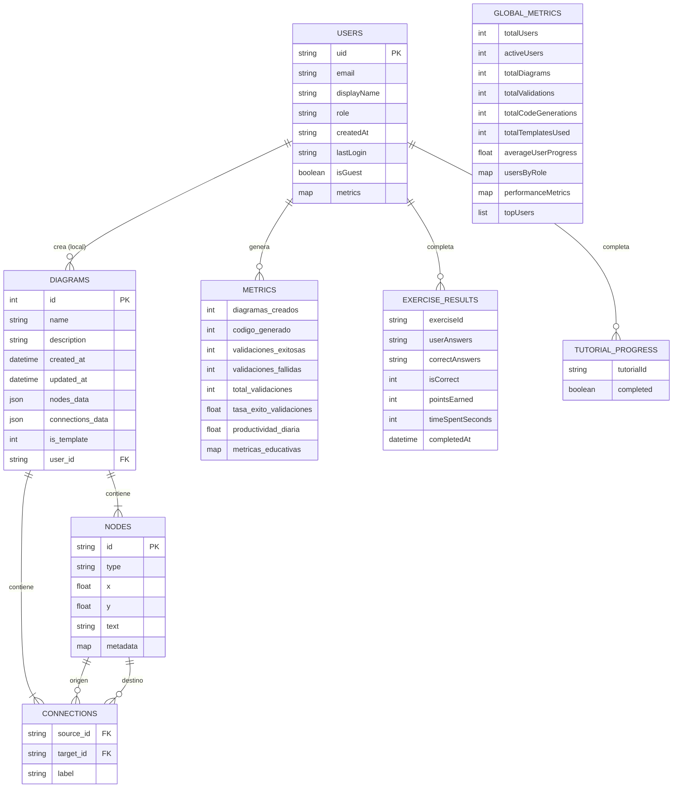

# Documentación de Base de Datos - FlowDiagram App

## 📋 Resumen Ejecutivo

FlowDiagram App utiliza una arquitectura de base de datos híbrida que combina **SQLite** para almacenamiento local y **Firebase Firestore** para autenticación, métricas en la nube y sincronización multi-dispositivo. Adicionalmente, se utiliza **SharedPreferences** para almacenamiento de preferencias y datos ligeros.

---

## 🏗️ Arquitectura General

```
┌─────────────────────────────────────────────────────────────┐
│                     CAPA DE APLICACIÓN                       │
│                         (Flutter)                            │
└──────────────────────────┬──────────────────────────────────┘
                           │
        ┌──────────────────┼──────────────────┐
        │                  │                  │
        ▼                  ▼                  ▼
┌──────────────┐  ┌────────────────┐  ┌─────────────────┐
│   SQLite     │  │    Firebase    │  │ SharedPreferences│
│   (Local)    │  │   (Firestore)  │  │     (Local)     │
└──────────────┘  └────────────────┘  └─────────────────┘
```

---

## 📦 1. Base de Datos SQLite (Local)

### Ubicación
- **Archivo**: `flowdiagram.db`
- **Ruta**: `[Application Documents Directory]/flowdiagram.db`
- **Versión**: 3
- **Servicio**: `DatabaseService` (`lib/services/database_service.dart`)

### Tabla: `diagrams`

Almacena todos los diagramas de flujo creados por el usuario, incluyendo plantillas predefinidas.

#### Estructura de la Tabla

```sql
CREATE TABLE diagrams(
  id INTEGER PRIMARY KEY AUTOINCREMENT,
  name TEXT NOT NULL,
  description TEXT,
  created_at TEXT NOT NULL,
  updated_at TEXT NOT NULL,
  nodes_data TEXT NOT NULL,
  connections_data TEXT NOT NULL,
  is_template INTEGER NOT NULL DEFAULT 0,
  user_id TEXT
);
```

#### Descripción de Campos

| Campo | Tipo | Restricciones | Descripción |
|-------|------|---------------|-------------|
| `id` | INTEGER | PRIMARY KEY, AUTOINCREMENT | Identificador único del diagrama |
| `name` | TEXT | NOT NULL | Nombre del diagrama |
| `description` | TEXT | NULL | Descripción opcional del diagrama |
| `created_at` | TEXT | NOT NULL | Fecha y hora de creación (ISO 8601) |
| `updated_at` | TEXT | NOT NULL | Fecha y hora de última actualización (ISO 8601) |
| `nodes_data` | TEXT | NOT NULL | JSON serializado con información de nodos |
| `connections_data` | TEXT | NOT NULL | JSON serializado con información de conexiones |
| `is_template` | INTEGER | NOT NULL, DEFAULT 0 | Indica si es plantilla (1) o diagrama de usuario (0) |
| `user_id` | TEXT | NULL | ID del usuario propietario del diagrama (agregado en migración v3) |

#### Estructura de `nodes_data` (JSON)

```json
[
  {
    "id": "start_1234567890_1",
    "type": "start",
    "x": 250.0,
    "y": 50.0,
    "text": "Inicio",
    "metadata": {}
  },
  {
    "id": "process_1234567890_2",
    "type": "process",
    "x": 250.0,
    "y": 150.0,
    "text": "resultado = a + b",
    "metadata": {}
  }
]
```

**Campos de cada nodo:**
- `id`: Identificador único del nodo
- `type`: Tipo de nodo (start, end, process, decision, input, output, variable, loop, connector, comment, subprocess, preparation)
- `x`: Coordenada X en el canvas
- `y`: Coordenada Y en el canvas
- `text`: Texto descriptivo del nodo
- `metadata`: Mapa de metadatos adicionales del nodo (puede contener información específica según el tipo de nodo)

#### Estructura de `connections_data` (JSON)

```json
[
  {
    "source_id": "start_1234567890_1",
    "target_id": "process_1234567890_2",
    "label": ""
  },
  {
    "source_id": "decision_1234567890_3",
    "target_id": "output_1234567890_4",
    "label": "Sí"
  }
]
```

**Campos de cada conexión:**
- `source_id`: ID del nodo origen
- `target_id`: ID del nodo destino
- `label`: Etiqueta de la conexión (ej: "Sí", "No", "Verdadero", "Falso")

#### Plantillas Predefinidas

Al crear la base de datos, se inicializan **20 plantillas educativas** basadas en el temario de Fundamentos de Programación. Las plantillas están organizadas por nivel de dificultad y unidad temática. El sistema verifica automáticamente cada vez que se abre la base de datos si faltan plantillas y las carga dinámicamente. Las plantillas antiguas (4 originales) son eliminadas automáticamente y reemplazadas por las nuevas.

**UNIDAD I - Nivel 1: Básico - Secuencia**
1. **01. Hola Mundo**
2. **02. Declaración y Tipos de Datos**
3. **03. Calculadora Básica**
4. **04. Conversión de Temperatura**

**UNIDAD I - Nivel 2: Decisiones - Selección**
5. **05. Par o Impar**
6. **06. Mayor de Tres Números**
7. **07. Calculadora con Menú**
8. **08. Clasificación de Triángulos**

**UNIDAD I - Nivel 3: Iteración - Bucles**
9. **09. Contador While**
10. **10. Validación de Entrada (Do-While)**
11. **11. Tabla de Multiplicar (For)**
12. **12. Factorial Iterativo**

**UNIDAD I - Nivel 4: Arreglos**
13. **13. Suma de Arreglo**
14. **14. Búsqueda Secuencial**
15. **15. Ordenamiento Burbuja**
16. **16. Ordenamiento Selección**

**UNIDAD II - Nivel 5: Funciones y Apuntadores**
17. **17. Función Suma**
18. **18. Función Factorial**
19. **19. Intercambio (Swap)**
20. **20. Apuntadores y Arreglos**

Las definiciones de las plantillas se encuentran en `lib/services/template_definitions.dart` (clase `TemplateDefinitions`).

**Nota importante**: El sistema implementa una verificación automática de plantillas mediante el método `_ensureTemplatesExist()` que se ejecuta cada vez que se abre la base de datos. Esto garantiza que todas las 20 plantillas estén disponibles incluso si la base de datos fue creada con una versión anterior. Las plantillas antiguas (`Suma de dos números`, `Verificación par/impar`, `Contador con bucle while`, `Factorial con subprocesos`) son detectadas y eliminadas automáticamente durante la migración.

#### Operaciones CRUD

| Operación | Método | Descripción |
|-----------|--------|-------------|
| CREATE | `saveDiagram(SavedDiagram)` | Guarda un nuevo diagrama |
| READ | `getDiagram(int id)` | Obtiene un diagrama por ID |
| READ ALL | `getAllDiagrams({includeTemplates, userId})` | Obtiene todos los diagramas, opcionalmente filtrados por usuario |
| READ BY USER | `getDiagramsByUser(String userId)` | Obtiene diagramas de un usuario específico |
| READ TEMPLATES | `getAllTemplates()` | Obtiene solo las plantillas |
| UPDATE | `updateDiagram(SavedDiagram)` | Actualiza un diagrama existente |
| DELETE | `deleteDiagram(int id)` | Elimina un diagrama |
| DELETE BY USER | `deleteDiagramsByUser(String userId)` | Elimina todos los diagramas de un usuario |
| RELOAD TEMPLATES | `reloadAllTemplates()` | Fuerza la recarga de todas las plantillas |

---

## ☁️ 2. Firebase Firestore (Nube)

### Servicio
- **AuthService** (`lib/services/auth_service.dart`)
- **MetricsService** (`lib/services/metrics_service.dart`)

### Colección: `users`

Almacena información de usuarios autenticados.

#### Estructura de Documento

```javascript
{
  uid: "firebase_user_id",
  email: "usuario@example.com",
  displayName: "Juan Pérez",
  role: "user",
  createdAt: "2025-11-25T08:00:00Z",
  lastLogin: "2025-11-25T10:30:00Z",
  isGuest: false,
  metrics: {
    // Métricas técnicas
    diagramas_creados: 15,
    codigo_generado: 12,
    validaciones_exitosas: 18,
    validaciones_fallidas: 3,
    total_validaciones: 21,
    plantillas_usadas: 5,
    ultima_plantilla: "01. Hola Mundo",
    total_acciones: 150,
    ultima_actividad: "2025-11-25T10:30:00Z",
    tasa_exito_validaciones: 0.857,
    productividad_diaria: 5.2,
    
    // Métricas educativas (anidadas bajo esta clave)
    metricas_educativas: {
      ejercicios_completados: 25,
      ejercicios_exitosos: 20,
      tiempo_total_minutos: 180,
      tiempo_promedio_minutos: 7.2,
      tasa_exito: 0.8,
      errores_totales: 30,
      promedio_errores: 1.2,
      pistas_usadas: 10,
      confianza_promedio: 3.8,
      autoevaluaciones: {
        "exercise_1": {
          nivel_confianza: 4,
          fecha: "2025-11-25T10:00:00Z",
          exitoso: true
        }
      }
    }
  }
}
```

#### Campos de Usuario

| Campo | Tipo | Descripción |
|-------|------|-------------|
| `uid` | String | ID único de Firebase Authentication |
| `email` | String | Correo electrónico del usuario |
| `displayName` | String | Nombre completo del usuario |
| `role` | String | Rol del usuario (`user`, `admin`, `guest`) |
| `createdAt` | String (ISO 8601) | Fecha de registro |
| `lastLogin` | String (ISO 8601) | Fecha de último inicio de sesión |
| `isGuest` | Boolean | Indica si es usuario invitado |
| `metrics` | Map | Métricas del usuario (ver estructura detallada abajo) |

#### Estructura de Métricas de Usuario

**Métricas Técnicas:**
- `diagramas_creados`: Cantidad de diagramas creados
- `codigo_generado`: Cantidad de veces que se generó código
- `validaciones_exitosas`: Validaciones sin errores
- `validaciones_fallidas`: Validaciones con errores
- `total_validaciones`: Total de validaciones realizadas
- `plantillas_usadas`: Cantidad de plantillas utilizadas
- `ultima_plantilla`: Nombre de la última plantilla usada
- `total_acciones`: Suma de todas las acciones realizadas
- `ultima_actividad`: ISO 8601 de última actividad
- `tasa_exito_validaciones`: Porcentaje de validaciones exitosas (0-1)
- `productividad_diaria`: Promedio de acciones por día

**Métricas Educativas:**
- `ejercicios_completados`: Total de ejercicios completados
- `ejercicios_exitosos`: Ejercicios resueltos correctamente
- `tiempo_total_minutos`: Tiempo acumulado en ejercicios
- `tiempo_promedio_minutos`: Tiempo promedio por ejercicio
- `tasa_exito`: Porcentaje de ejercicios exitosos (0-1)
- `errores_totales`: Suma de errores cometidos
- `promedio_errores`: Promedio de errores por ejercicio
- `pistas_usadas`: Cantidad de pistas solicitadas
- `confianza_promedio`: Nivel promedio de autoevaluación (1-5)
- `autoevaluaciones`: Objeto con evaluaciones por ejercicio

### Colección: `global_metrics`

Almacena métricas agregadas de todos los usuarios (solo accesible por administradores).

#### Documento: `current`

```javascript
{
  totalUsers: 150,
  activeUsers: 85,
  totalDiagrams: 1250,
  totalValidations: 3500,
  totalCodeGenerations: 1100,
  totalTemplatesUsed: 450,
  averageUserProgress: 0.65,
  usersByRole: {
    user: 148,
    admin: 2
  },
  performanceMetrics: {
    diagrams_per_user: 8.33,
    validations_per_user: 23.33,
    activity_rate: 0.567
  },
  topUsers: [
    {
      uid: "user_id_1",
      displayName: "Usuario Top 1",
      diagramas: 50,
      validaciones: 120,
      progreso: 850.0
    }
  ],
  generatedAt: "2025-11-25T10:30:00Z",
  lastUpdated: "2025-11-25T10:30:00Z"
}
```

**Nota**: Los campos `totalCodeGenerations`, `totalTemplatesUsed` y `lastUpdated` se escriben directamente en Firestore vía transacciones en `_updateGlobalMetrics()`, pero no forman parte del modelo `GlobalMetrics` de Dart. Los campos del modelo Dart son: `totalUsers`, `activeUsers`, `totalDiagrams`, `totalValidations`, `averageUserProgress`, `usersByRole`, `performanceMetrics`, `topUsers`, `generatedAt`.

#### Campos de Métricas Globales

| Campo | Tipo | Descripción |
|-------|------|-------------|
| `totalUsers` | Integer | Total de usuarios registrados |
| `activeUsers` | Integer | Usuarios activos en últimos 30 días |
| `totalDiagrams` | Integer | Total de diagramas creados |
| `totalValidations` | Integer | Total de validaciones realizadas |
| `totalCodeGenerations` | Integer | Total de generaciones de código |
| `totalTemplatesUsed` | Integer | Total de veces que se usaron plantillas |
| `averageUserProgress` | Double | Progreso promedio de usuarios (0-1) |
| `usersByRole` | Map | Cantidad de usuarios por rol |
| `performanceMetrics` | Map | Métricas de rendimiento generales |
| `topUsers` | Array | Lista de usuarios destacados |
| `generatedAt` | String (ISO 8601) | Fecha de última generación completa |
| `lastUpdated` | String (ISO 8601) | Fecha de última actualización incremental |

---

## 💾 3. SharedPreferences (Local)

### Uso
Almacenamiento de preferencias del usuario y datos ligeros que no requieren una base de datos completa.

### Servicios que usan SharedPreferences

#### 3.1 ExerciseService

**Claves:**
- `completed_exercises`: Lista de IDs de ejercicios completados
- `exercise_results`: Lista JSON con resultados de ejercicios

**Estructura de `exercise_results`:**
```json
[
  {
    "exerciseId": "exercise_1",
    "userAnswers": "opt1,opt2",
    "correctAnswers": "opt1,opt2",
    "isCorrect": 1,
    "pointsEarned": 10,
    "completedAt": "2025-11-25T10:00:00Z",
    "timeSpentSeconds": 45
  }
]
```

#### 3.2 TutorialService

**Claves:**
- `tutorial_first_time`: Boolean indicando si es primera vez del usuario
- `tutorial_completed_[tutorialId]`: Boolean para cada tutorial completado

**Ejemplo:**
```
tutorial_first_time: false
tutorial_completed_welcome: true
tutorial_completed_basics: true
tutorial_completed_start_node: true
```

#### 3.3 ThemeService

**Claves:**
- `app_theme_mode`: String con el tema seleccionado

**Valores posibles:**
```
"AppThemeMode.light"
"AppThemeMode.dark"
"AppThemeMode.system"
```

#### 3.4 AuthService (Caché de usuario)

**Claves:**
- `cached_user`: JSON serializado con los datos del usuario actual

**Estructura de `cached_user`:**
```json
{
  "uid": "firebase_user_id",
  "email": "usuario@example.com",
  "displayName": "Juan Pérez",
  "role": "user",
  "createdAt": "2025-11-25T08:00:00Z",
  "lastLogin": "2025-11-25T10:30:00Z",
  "metrics": {},
  "isGuest": false
}
```

**Uso**: Permite el inicio de sesión offline verificando las credenciales contra la caché local cuando no hay conexión a internet.

---

## 📊 Diagrama Entidad-Relación (Mermaid)



---

## 🔄 Flujo de Datos

### Escenario 1: Usuario crea un diagrama

```
┌──────────────┐
│   Usuario    │
│  crea nodo   │
└──────┬───────┘
       │
       ▼
┌──────────────────┐
│  Editor Screen   │
│  (nodes list)    │
└──────┬───────────┘
       │
       ▼
┌──────────────────┐
│ Usuario guarda   │
│   diagrama       │
└──────┬───────────┘
       │
       ├────────────────────────┬──────────────────────┐
       ▼                        ▼                      ▼
┌─────────────┐      ┌──────────────────┐   ┌────────────────┐
│   SQLite    │      │ MetricsService   │   │    Firebase    │
│  diagrams   │      │ trackUserAction  │   │ users.metrics  │
│   tabla     │      │ (diagrama_creado)│   │   (online)     │
└─────────────┘      └──────────────────┘   └────────────────┘
```

### Escenario 2: Usuario completa un ejercicio

```
┌────────────────┐
│    Usuario     │
│ completa       │
│  ejercicio     │
└────────┬───────┘
         │
         ▼
┌────────────────────┐
│ ExerciseService    │
│ saveExerciseResult │
└────────┬───────────┘
         │
         ├──────────────────────┬───────────────────────┐
         ▼                      ▼                       ▼
┌──────────────────┐  ┌─────────────────┐   ┌──────────────────┐
│SharedPreferences │  │ MetricsService  │   │     Firebase     │
│exercise_results  │  │trackEducational │   │ users.metrics    │
│completed_ex...   │  │    Metric       │   │  .educativas     │
└──────────────────┘  └─────────────────┘   └──────────────────┘
```

### Escenario 3: Administrador consulta métricas globales

```
┌──────────────┐
│Administrador │
│ solicita     │
│  métricas    │
└──────┬───────┘
       │
       ▼
┌──────────────────┐
│ MetricsService   │
│getGlobalMetrics  │
└──────┬───────────┘
       │
       ├─────────────► Verifica role == admin
       │
       ├─────────────► Verifica internet
       │
       ▼
┌─────────────────────┐
│     Firebase        │
│  global_metrics     │
│  .current (doc)     │
└─────────────────────┘
```

---

## 🔐 Seguridad y Permisos

### Firebase Firestore Rules (Sugeridas)

```javascript
rules_version = '2';
service cloud.firestore {
  match /databases/{database}/documents {
    
    // Reglas para usuarios
    match /users/{userId} {
      // Lectura: solo el propio usuario o admin
      allow read: if request.auth != null && 
                  (request.auth.uid == userId || 
                   get(/databases/$(database)/documents/users/$(request.auth.uid)).data.role == 'admin');
      
      // Escritura: solo el propio usuario
      allow write: if request.auth != null && request.auth.uid == userId;
    }
    
    // Reglas para métricas globales
    match /global_metrics/{document} {
      // Solo administradores pueden leer/escribir
      allow read, write: if request.auth != null && 
                         get(/databases/$(database)/documents/users/$(request.auth.uid)).data.role == 'admin';
    }
  }
}
```

---

## 📈 Métricas y Analytics

### Métricas Técnicas Rastreadas

1. **Diagramas**
   - Cantidad creada
   - Tiempo promedio de creación
   - Plantillas más usadas

2. **Validaciones**
   - Total realizadas
   - Tasa de éxito
   - Errores más comunes

3. **Generación de Código**
   - Cantidad generada
   - Lenguajes más usados (actualmente solo C)

### Métricas Educativas Rastreadas

1. **Ejercicios**
   - Completados vs. iniciados
   - Tasa de éxito por categoría
   - Tiempo promedio de resolución
   - Errores cometidos

2. **Autoevaluación**
   - Nivel de confianza (1-5)
   - Correlación confianza-éxito
   - Evolución temporal

3. **Tutoriales**
   - Tutoriales completados
   - Tiempo de visualización

---

## 🚀 Optimizaciones y Consideraciones

### Rendimiento

1. **SQLite**
   - Índices en `id` (PRIMARY KEY automático)
   - Consultas optimizadas con `WHERE` y `ORDER BY`
   - JSON para datos complejos evita múltiples tablas

2. **Firebase**
   - Caché local automático
   - Consultas limitadas con verificación de internet
   - Actualización batch de métricas

3. **SharedPreferences**
   - Solo para datos ligeros (<1MB)
   - Lectura síncrona en memoria

### Escalabilidad

1. **SQLite**
   - Limite recomendado: ~10,000 diagramas
   - Considera migración a cloud storage si supera el límite

2. **Firebase**
   - Escalabilidad automática
   - Costos basados en lecturas/escrituras
   - Considera paginación para listas grandes

### Modo Offline

1. **SQLite**: ✅ Completamente funcional offline
2. **Firebase**: ⚠️ Requiere internet para sincronización
3. **SharedPreferences**: ✅ Completamente funcional offline

**Modo Invitado:**
- Solo usa SQLite y SharedPreferences
- No sincroniza con Firebase
- Sin métricas en la nube

---

## 🛠️ Mantenimiento

### Migraciones Implementadas

La base de datos actualmente está en la versión 3, con las siguientes migraciones:

```dart
Future<Database> _initDatabase() async {
  // ...
  return await openDatabase(
    path, 
    version: 3,
    onCreate: _onCreate,
    onUpgrade: _onUpgrade,
    onOpen: (db) async {
      // Verificar y cargar plantillas cada vez que se abre
      await _ensureTemplatesExist(db);
    },
  );
}

Future<void> _onUpgrade(Database db, int oldVersion, int newVersion) async {
  if (oldVersion < 2) {
    // Eliminar plantillas antiguas (4) y cargar las nuevas (20)
    await _migrateToNewTemplates(db);
  }
  if (oldVersion < 3) {
    // Agregar columna user_id para separar diagramas por usuario
    await db.execute('ALTER TABLE diagrams ADD COLUMN user_id TEXT');
  }
}
```

### Respaldo y Restauración

**SQLite:**
```dart
// Ubicación del archivo
final dbPath = join(documentsDirectory.path, 'flowdiagram.db');

// Respaldar
await File(dbPath).copy('backup/flowdiagram_backup.db');

// Restaurar
await File('backup/flowdiagram_backup.db').copy(dbPath);
```

**Firebase:**
- Exportación manual desde Firebase Console
- Implementar Cloud Functions para respaldos automáticos

---

## 📚 Referencias

- **SQLite Documentation**: https://www.sqlite.org/docs.html
- **sqflite Package**: https://pub.dev/packages/sqflite
- **Firebase Firestore**: https://firebase.google.com/docs/firestore
- **SharedPreferences**: https://pub.dev/packages/shared_preferences

---

*Documentación actualizada el 7 de marzo de 2026*
*Versión de la aplicación: 1.0.0*
*Versión de base de datos SQLite: 3*
