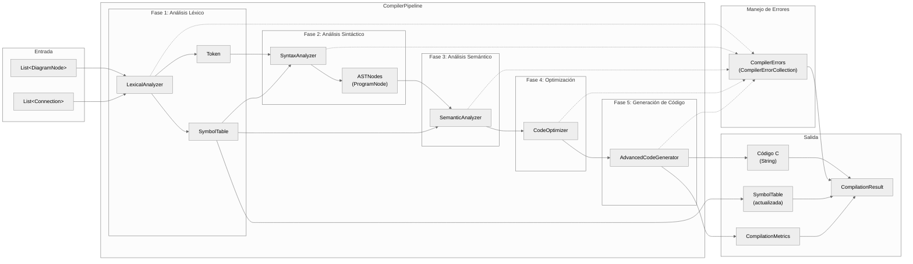

# Diagrama de Componentes — FlowCode

Representa la arquitectura de componentes de la aplicación FlowCode, organizada en capas lógicas con sus dependencias e interfaces.

---

## DC-01: Diagrama de Componentes General

```mermaid
%%{init: {'theme': 'neutral'}}%%
graph TB
    subgraph EXT["Servicios Externos"]
        FA["Firebase Authentication"]
        FS["Cloud Firestore"]
        SP["SharedPreferences"]
        SQ["SQLite (sqflite)"]
        GAL["SaverGallery"]
    end

    subgraph APP["FlowCode — Aplicación Android (Flutter)"]

        subgraph PRES["Capa de Presentación"]
            direction TB
            MAIN["main.dart<br/>(FlowDiagramApp)"]
            AG["AuthGuard"]

            subgraph SCREENS["Pantallas (Screens)"]
                direction TB
                LOGIN["LoginScreen"]
                REG["RegisterScreen"]
                LOAD["LoadDiagramScreen"]
                EDITOR["EditorScreen"]
                PROF["ProfileScreen"]
                METR["MetricsScreen"]
                ADMIN["AdminMetricsScreen"]
                EXERC["ExercisesScreen"]
                TUT["TutorialListScreen"]
                WELCOME["WelcomeScreen"]
            end

            subgraph WIDGETS["Componentes de UI (Widgets)"]
                direction TB
                CANVAS["FlowDiagramCanvas"]
                PALETTE["NodePalette"]
                CONCEPTS["ProgrammingConceptsPalette"]
                SIDEPAN["EditorSidePanel"]
                NED["NodeEditorDialog"]
                VRD["ValidationResultDialog"]
                CRD["CompilerResultsDialog"]
                SAVED["SaveDiagramDialog"]
                TSEL["ThemeSelectorWidget"]
                MCHRT["MetricsChartWidget"]

                subgraph DIALOGS["Diálogos Especializados"]
                    PROCD["ProcessNodeDialog"]
                    DECD["DecisionNodeDialog"]
                    DATAD["DataNodeDialog"]
                    PREPD["PreparationNodeDialog"]
                    SUBD["SubprocessNodeDialog"]
                    CONND["ConnectorNodeDialog"]
                    COMMD["CommentNodeDialog"]
                end
            end

            subgraph THEMES["Temas"]
                APPTH["AppThemes"]
            end
        end

        subgraph DOMAIN["Capa de Dominio (Modelos)"]
            direction TB
            DN["DiagramNode"]
            SD["SavedDiagram"]
            NDR["NodeDialogResult"]
            DV["DiagramValidator<br/>ISO5807ConnectionRules"]
            CG["CodeGenerator"]
            UM["UserModel"]
            MM["MetricModel"]
            EM["ExerciseModel"]
            TS["TutorialStep"]
        end

        subgraph COMPILER["Conversor Fuente-a-Fuente"]
            direction TB
            CP["CompilerPipeline"]

            subgraph PHASES["Fases del Conversor"]
                direction TB
                P1["Fase 1: LexicalAnalyzer<br/>(Token, SymbolTable)"]
                P2["Fase 2: SyntaxAnalyzer<br/>(ASTNodes)"]
                P3["Fase 3: SemanticAnalyzer"]
                P4["Fase 4: CodeOptimizer"]
                P5["Fase 5: AdvancedCodeGenerator"]
            end

            CE["CompilerErrors"]
        end

        subgraph SERV["Capa de Servicios"]
            direction TB
            AUTH["AuthService"]
            DBS["DatabaseService"]
            TMPL["TemplateDefinitions"]
            DES["DiagramExportService"]
            MSRV["MetricsService"]
            SYNC["SyncService"]
            THSRV["ThemeService"]
            TUTSRV["TutorialService"]
            EXSRV["ExerciseService"]
            EXPS["ExportService"]
        end
    end

    %% --- Flujo de entrada ---
    MAIN --> AG
    AG --> LOGIN
    AG --> LOAD
    LOGIN --> REG
    LOGIN --> LOAD

    %% --- Pantallas a Widgets ---
    LOAD --> EDITOR
    EDITOR --> CANVAS
    EDITOR --> PALETTE
    EDITOR --> CONCEPTS
    EDITOR --> SIDEPAN
    EDITOR --> NED
    EDITOR --> VRD
    EDITOR --> CRD
    EDITOR --> SAVED

    %% --- NodeEditorDialog a Diálogos Especializados ---
    NED --> PROCD
    NED --> DECD
    NED --> DATAD
    NED --> PREPD
    NED --> SUBD
    NED --> CONND
    NED --> COMMD

    %% --- Pantallas a Servicios ---
    EDITOR --> DBS
    EDITOR --> DES
    EDITOR --> MSRV
    EDITOR --> AUTH
    LOAD --> DBS
    LOAD --> MSRV
    LOAD --> TUTSRV
    LOGIN --> AUTH
    REG --> AUTH
    PROF --> AUTH
    METR --> MSRV
    ADMIN --> MSRV
    ADMIN --> EXPS
    EXERC --> EXSRV
    TUT --> TUTSRV
    MAIN --> THSRV

    %% --- Editor a Conversor ---
    EDITOR --> CP
    CP --> P1
    P1 --> P2
    P2 --> P3
    P3 --> P4
    P4 --> P5
    CP --> CE

    %% --- Editor a Modelos ---
    EDITOR --> DN
    EDITOR --> DV
    EDITOR --> CG
    EDITOR --> SD
    EDITOR --> NDR

    %% --- Servicios a Modelos ---
    DBS --> SD
    DBS --> TMPL
    AUTH --> UM
    MSRV --> MM
    EXSRV --> EM
    TUTSRV --> TS

    %% --- Servicios a Externos ---
    AUTH --> FA
    AUTH --> FS
    AUTH --> SP
    MSRV --> FS
    SYNC --> FS
    SYNC --> DBS
    DBS --> SQ
    DES --> GAL
    THSRV --> SP
    TUTSRV --> SP
    EXSRV --> SP

    %% --- Temas ---
    THSRV --> APPTH
```

---

## DC-02: Diagrama de Componentes del Conversor (detalle)

Detalla la estructura interna del conversor fuente-a-fuente y las interfaces entre cada fase del pipeline.

---

## DC-03: Diagrama de Componentes por Capas

Vista simplificada de la arquitectura en capas con interfaces proporcionadas y requeridas.

```mermaid
%%{init: {'theme': 'neutral'}}%%
graph TB
    USUARIO["Actor: Usuario"]

    subgraph L1["Capa de Presentación"]
        direction LR
        S["Screens<br/>(15 pantallas)"]
        W["Widgets<br/>(25 componentes de UI)"]
        T["Themes<br/>(AppThemes)"]
    end

    subgraph L2["Capa de Dominio"]
        direction LR
        MOD["Modelos de Datos<br/>(DiagramNode, SavedDiagram,<br/>UserModel, MetricModel,<br/>ExerciseModel, TutorialStep)"]
        VAL["Validación<br/>(DiagramValidator,<br/>ISO5807ConnectionRules)"]
        GEN["Generación Básica<br/>(CodeGenerator)"]
    end

    subgraph L3["Conversor Fuente-a-Fuente"]
        direction LR
        PIPE["CompilerPipeline"]
        ANALYSIS["Análisis<br/>(Léxico + Sintáctico<br/>+ Semántico)"]
        OPTIM["Optimización<br/>(CodeOptimizer)"]
        CODEGEN["Generación Avanzada<br/>(AdvancedCodeGenerator)"]
        SYMB["Tabla de Símbolos<br/>(SymbolTable)"]
    end

    subgraph L4["Capa de Servicios"]
        direction LR
        AUTHSRV["Autenticación<br/>(AuthService)"]
        DATASRV["Persistencia<br/>(DatabaseService,<br/>TemplateDefinitions)"]
        EXPORTSRV["Exportación<br/>(DiagramExportService,<br/>ExportService)"]
        CLOUDSRV["Sincronización<br/>(SyncService,<br/>MetricsService)"]
        LOCALSRV["Preferencias Locales<br/>(ThemeService,<br/>TutorialService,<br/>ExerciseService)"]
    end

    subgraph L5["Infraestructura Externa"]
        direction LR
        FIREBASE["Firebase<br/>(Auth + Firestore)"]
        SQLITE["SQLite<br/>(sqflite)"]
        DEVICE["Dispositivo Android<br/>(SharedPreferences,<br/>SaverGallery,<br/>PathProvider,<br/>PermissionHandler)"]
    end

    USUARIO --> L1
    L1 --> L2
    L1 --> L3
    L1 --> L4
    L2 --> L4
    L3 --> L2
    L4 --> L5
```

---

## Descripción de los Componentes Principales

### Capa de Presentación

| Componente | Archivo | Descripción |
|---|---|---|
| `FlowDiagramApp` | `lib/main.dart` | Punto de entrada de la aplicación. Inicializa Firebase y configura MaterialApp con temas |
| `AuthGuard` | `lib/widgets/auth_guard.dart` | Componente de control de acceso que redirige a login o pantalla principal |
| `EditorScreen` | `lib/screens/editor_screen.dart` | Pantalla principal del editor visual. Orquesta canvas, paleta, conversor y exportación |
| `LoadDiagramScreen` | `lib/screens/load_diagram_screen.dart` | Gestor de proyectos con pestañas para diagramas del usuario y plantillas |
| `FlowDiagramCanvas` | `lib/widgets/flow_diagram_canvas_final.dart` | Canvas interactivo con soporte para gestos (arrastrar, zoom, pan) |
| `NodeEditorDialog` | `lib/widgets/node_editor_dialog.dart` | Router que delega a diálogos especializados según el tipo de nodo |
| `NodePalette` | `lib/widgets/node_palette.dart` | Paleta de nodos ISO 5807 arrastrables al canvas |
| `EditorSidePanel` | `lib/widgets/editor_side_panel.dart` | Panel lateral con visualización del código C generado en tiempo real |

### Capa de Dominio (Modelos)

| Componente | Archivo | Descripción |
|---|---|---|
| `DiagramNode` | `lib/models/diagram_node.dart` | Modelo de nodo con tipo (NodeType), posición, texto y metadata |
| `SavedDiagram` | `lib/models/saved_diagram.dart` | Modelo de proyecto serializable con nodos, conexiones y metadatos |
| `DiagramValidator` | `lib/models/diagram_validator.dart` | Motor de validación estructural con reglas ISO 5807 |
| `CodeGenerator` | `lib/models/code_generator.dart` | Generador de código C básico (traducción directa nodo-a-sentencia) |
| `NodeDialogResult` | `lib/models/node_dialog_result.dart` | Resultado de edición con soporte para generación de estructuras de control |
| `UserModel` | `lib/models/user_model.dart` | Modelo de usuario con uid, email, rol y timestamps |
| `MetricModel` | `lib/models/metric_model.dart` | Modelo de métricas técnicas globales y por usuario |

### Conversor Fuente-a-Fuente

| Componente | Archivo | Descripción |
|---|---|---|
| `CompilerPipeline` | `lib/compiler/compiler_pipeline.dart` | Orquestador del pipeline de 5 fases. Gestiona el flujo de datos entre fases y recopila errores |
| `LexicalAnalyzer` | `lib/compiler/lexical_analyzer.dart` | Fase 1: recorre los nodos del diagrama, extrae tokens y construye la tabla de símbolos inicial |
| `Token` | `lib/compiler/token.dart` | Representación de tokens léxicos con tipo, valor y posición |
| `SymbolTable` | `lib/compiler/symbol_table.dart` | Tabla de símbolos con registro de variables, tipos, scopes y estado de uso |
| `SyntaxAnalyzer` | `lib/compiler/syntax_analyzer.dart` | Fase 2: parsea tokens y construye el Árbol de Sintaxis Abstracta (AST) |
| `ASTNodes` | `lib/compiler/ast_nodes.dart` | Nodos del AST: ProgramNode, DeclarationNode, AssignmentNode, IfNode, WhileNode, ForNode, etc. |
| `SemanticAnalyzer` | `lib/compiler/semantic_analyzer.dart` | Fase 3: valida tipos, declaración/uso de variables y compatibilidad de expresiones |
| `CodeOptimizer` | `lib/compiler/code_optimizer.dart` | Fase 4: plegado de constantes, eliminación de código muerto, simplificación de expresiones |
| `AdvancedCodeGenerator` | `lib/compiler/code_generator_advanced.dart` | Fase 5: genera código C estructurado a partir del AST optimizado |
| `CompilerErrors` | `lib/compiler/compiler_errors.dart` | Sistema de errores con severidad, código, fase de origen y mensajes descriptivos |

### Capa de Servicios

| Componente | Archivo | Descripción |
|---|---|---|
| `AuthService` | `lib/services/auth_service.dart` | Autenticación con Firebase Auth, registro, login, modo invitado y caché local |
| `DatabaseService` | `lib/services/database_service.dart` | Persistencia SQLite: CRUD de diagramas, plantillas y datos del usuario |
| `TemplateDefinitions` | `lib/services/template_definitions.dart` | Definiciones de plantillas predefinidas de diagramas de flujo |
| `DiagramExportService` | `lib/services/diagram_export_service.dart` | Exportación de diagramas a PNG/JPG con manejo de permisos Android |
| `ExportService` | `lib/services/export_service.dart` | Exportación de métricas a PDF, PNG, JPG y TXT |
| `MetricsService` | `lib/services/metrics_service.dart` | Registro y consulta de métricas técnicas via Firestore |
| `SyncService` | `lib/services/sync_service.dart` | Sincronización bidireccional de diagramas entre SQLite y Firestore |
| `ThemeService` | `lib/services/theme_service.dart` | Gestión de tema visual (claro/oscuro/sistema) con SharedPreferences |
| `TutorialService` | `lib/services/tutorial_service.dart` | Control de progreso de tutoriales con SharedPreferences |
| `ExerciseService` | `lib/services/exercise_service.dart` | Gestión de ejercicios de comprensión y resultados con SharedPreferences |

### Infraestructura Externa

| Componente | Tecnología | Descripción |
|---|---|---|
| Firebase Authentication | `firebase_auth` | Autenticación de usuarios (email/password) |
| Cloud Firestore | `cloud_firestore` | Base de datos en la nube para métricas, usuarios y sincronización |
| SQLite | `sqflite` | Base de datos local para diagramas y plantillas |
| SharedPreferences | `shared_preferences` | Almacenamiento clave-valor para preferencias, caché y progreso |
| SaverGallery | `saver_gallery` | Guardado de imágenes exportadas en la galería del dispositivo |
| PermissionHandler | `permission_handler` | Solicitud y gestión de permisos Android |
| PathProvider | `path_provider` | Acceso a directorios del sistema de archivos |

---

## Convención de Renderizado

Estos diagramas utilizan la sintaxis **Mermaid** con la directiva `%%{init: {'theme': 'neutral'}}%%` para renderizado en escala de grises (blanco y negro) adecuado para reportes formales.

**Opciones para generar imágenes profesionales:**

1. **Mermaid Live Editor** ([mermaid.live](https://mermaid.live)): Pegar cada bloque Mermaid, seleccionar tema `neutral` y exportar a PNG/SVG.
2. **VS Code**: Extensión *Markdown Preview Mermaid Support* para previsualización directa.
3. **Exportación a PDF**: Pandoc con filtro mermaid-filter o extensión *Markdown PDF* de VS Code.
4. **Tema formal**: La directiva `neutral` fuerza escala de grises, ideal para documentación académica.
