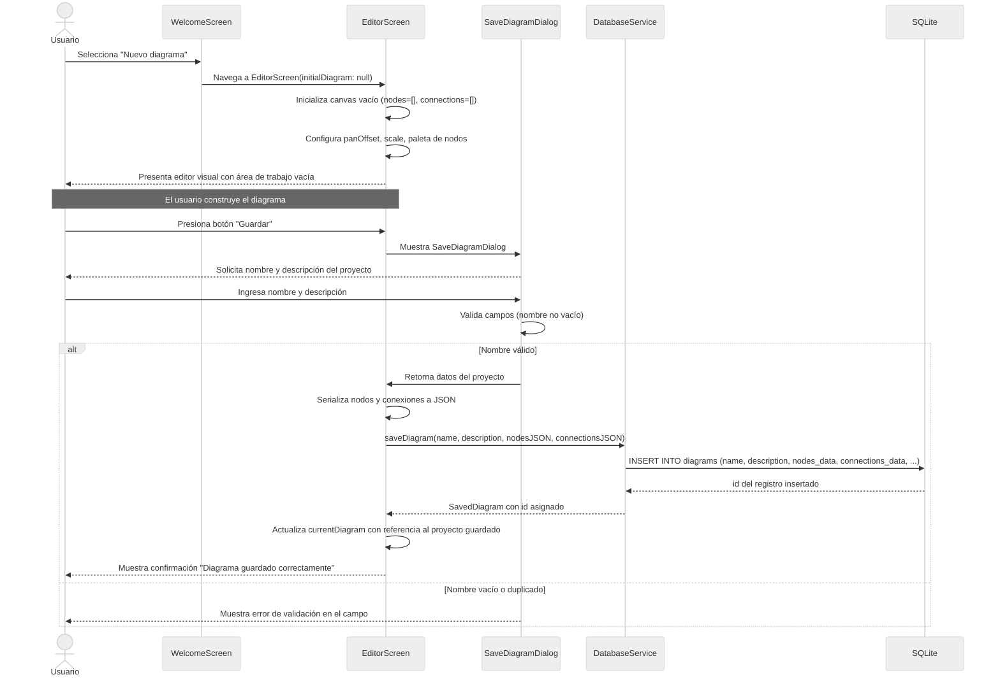
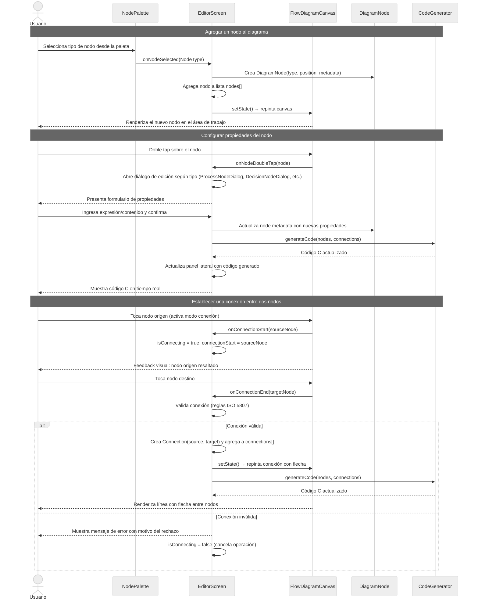
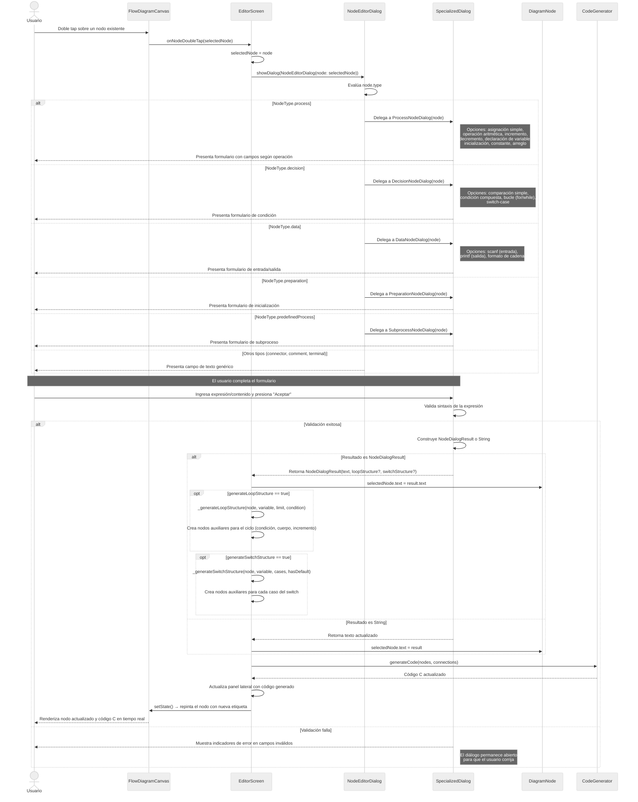
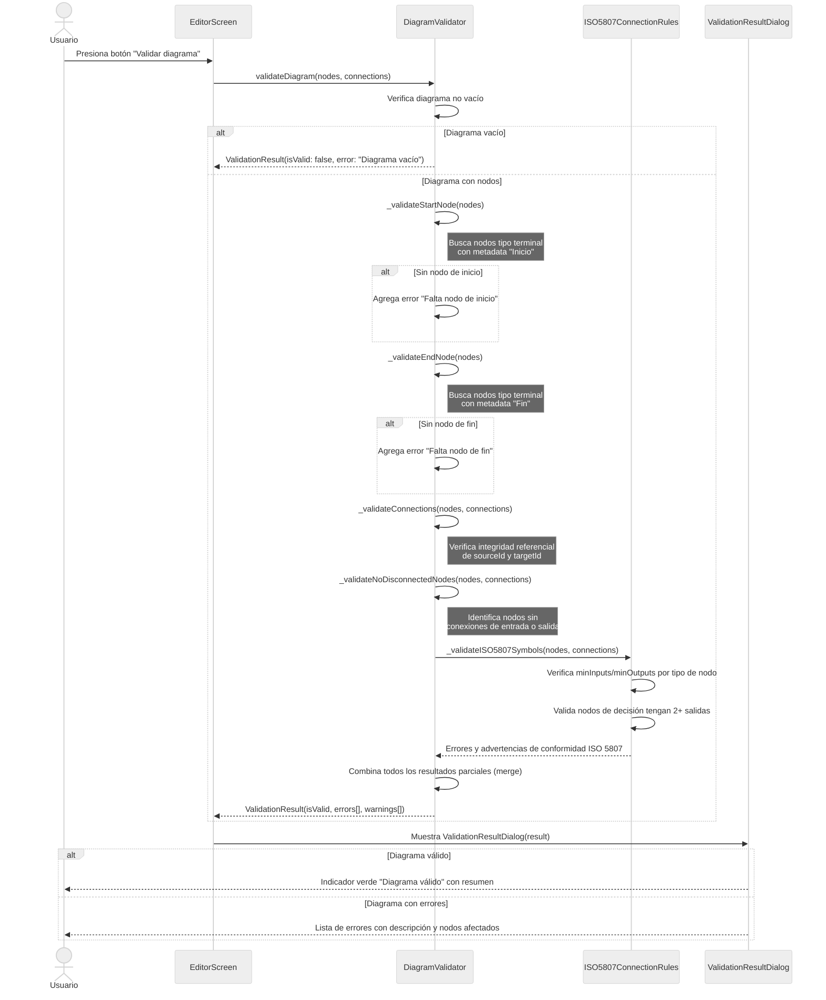
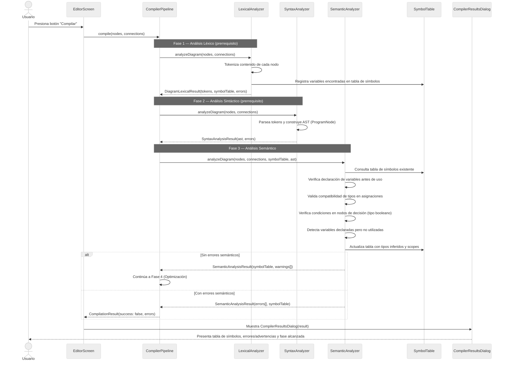
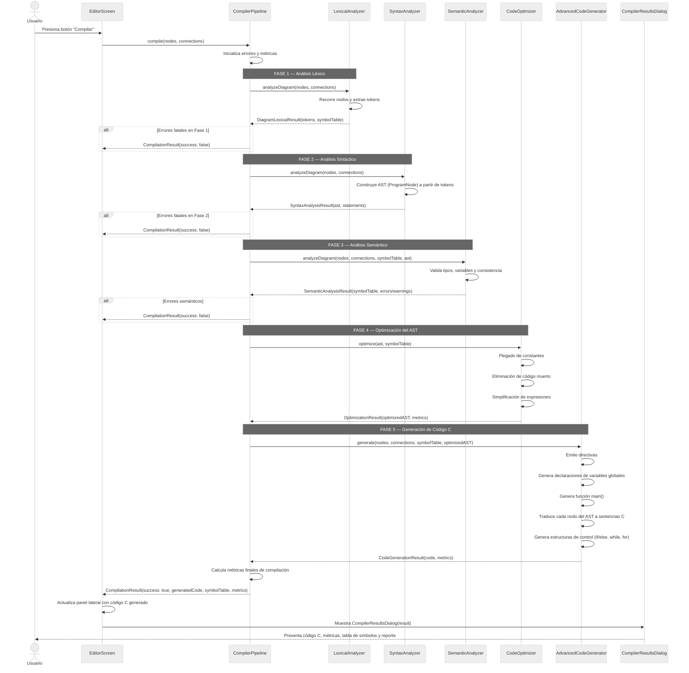
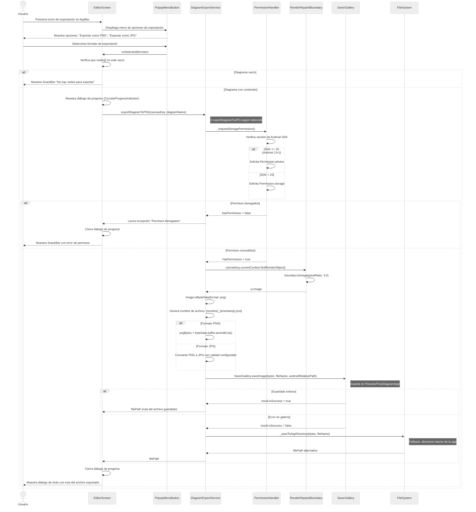
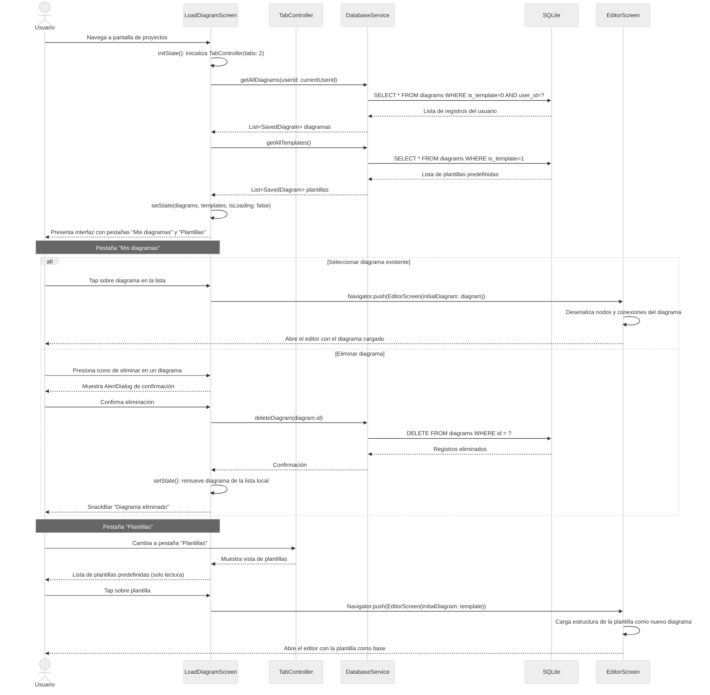
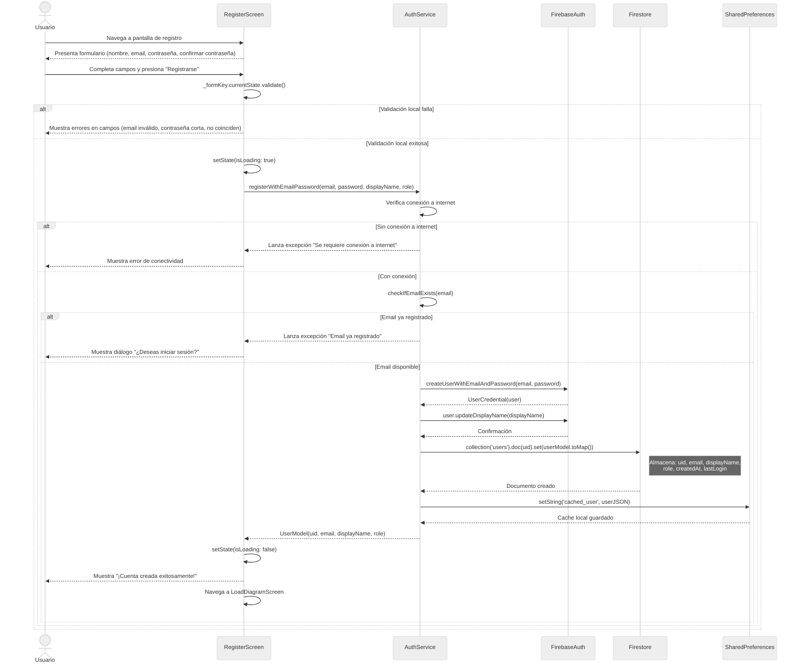
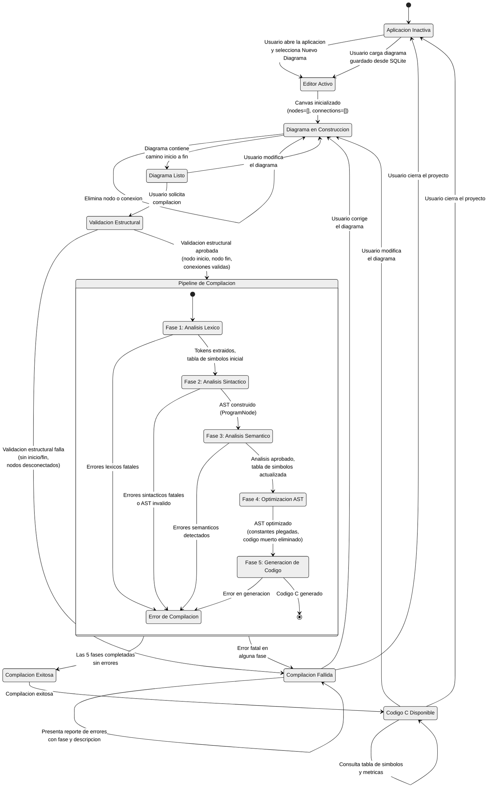

# Diagramas de Secuencia — Flujo Principal

---

## DS-CU01: Crear Nuevo Diagrama

Describe la interacción entre el usuario y los componentes del sistema al crear un nuevo proyecto de diagrama de flujo.

---

## DS-CU02: Agregar y Conectar Elementos

Describe el proceso de agregar nodos al diagrama y establecer conexiones entre ellos para construir la lógica del algoritmo.

---

## DS-CU03: Editar Propiedades de Elementos

Describe el proceso de edición de las propiedades de un elemento del diagrama, incluyendo la selección del nodo, la apertura del diálogo especializado según el tipo de nodo, la validación de la entrada y la actualización del código generado.

---

## DS-CU04: Validar Estructura del Diagrama

Describe el proceso de validación estructural del diagrama antes de que pueda ser compilado o exportado.

---

## DS-CU05: Realizar Análisis Semántico

Describe la fase de análisis semántico del compilador fuente-a-fuente, que valida la consistencia de variables y tipos.

---

## DS-CU06: Generar Código C

Describe el flujo completo del pipeline de compilación fuente-a-fuente, desde el diagrama de flujo hasta la generación de código funcional en lenguaje C.

---

## DS-CU07: Exportar Proyecto Completo

Describe el flujo de exportación del diagrama como imagen (PNG/JPG), incluyendo la solicitud de permisos de almacenamiento, la captura del canvas y el guardado del archivo.

---

## DS-CU08: Organizar Proyectos en Carpetas

Describe el flujo de organización de proyectos guardados mediante la interfaz de gestión de diagramas, incluyendo la visualización categorizada por pestañas, la carga, eliminación y navegación entre proyectos.

---

## DS-CU09: Registrar Cuenta de Usuario

Describe el flujo de creación de una nueva cuenta de usuario mediante Firebase Authentication para habilitar la sincronización en la nube.

---

## DE-CU06: Diagrama de Estados — Generar Código C

Representa los estados y transiciones del sistema durante el ciclo de vida completo de la generación de código: desde el inicio de la aplicación, la construcción del diagrama, la ejecución del pipeline de compilación fuente-a-fuente con sus cinco fases, hasta la obtención del código C generado o la notificación de errores.

### Descripcion de los Estados

| Estado | Descripcion |
|---|---|
| **Aplicacion Inactiva** | Estado inicial. La aplicacion se encuentra en la pantalla de bienvenida o seleccion de proyectos. |
| **Editor Activo** | El `EditorScreen` se ha cargado con un canvas vacio o con un diagrama existente desde SQLite. |
| **Diagrama en Construccion** | El usuario esta agregando nodos, conexiones y configurando propiedades. Estado iterativo. |
| **Diagrama Listo** | El diagrama contiene al menos un camino completo de inicio a fin y puede ser compilado. |
| **Validacion Estructural** | `DiagramValidator` verifica la presencia de nodos inicio/fin, conexiones validas y conformidad ISO 5807. |
| **Fase 1: Analisis Lexico** | `LexicalAnalyzer` recorre cada nodo, extrae tokens y construye la tabla de simbolos inicial. |
| **Fase 2: Analisis Sintactico** | `SyntaxAnalyzer` parsea los tokens y construye el Arbol de Sintaxis Abstracta (`ProgramNode`). |
| **Fase 3: Analisis Semantico** | `SemanticAnalyzer` valida tipos de datos, declaracion/uso de variables y compatibilidad de expresiones. |
| **Fase 4: Optimizacion AST** | `CodeOptimizer` aplica plegado de constantes, eliminacion de codigo muerto y simplificacion de expresiones. |
| **Fase 5: Generacion de Codigo** | `AdvancedCodeGenerator` traduce el AST optimizado a codigo fuente en lenguaje C. |
| **Error de Compilacion** | Subestado dentro del pipeline. Se recopilan errores de la fase que fallo. |
| **Compilacion Exitosa** | `CompilationResult(success: true)`. El pipeline completo las 5 fases sin errores criticos. |
| **Compilacion Fallida** | `CompilationResult(success: false)`. Se presenta el reporte con los errores, la fase donde ocurrieron y las metricas parciales. |
| **Codigo C Disponible** | El codigo C generado esta disponible para visualizacion en el panel lateral, consulta de metricas y exportacion. |

### Transiciones Clave del Pipeline

| Transicion | Condicion de Guarda | Datos Producidos |
|---|---|---|
| F1 a F2 | `!errors.hasFatalErrors` | `DiagramLexicalResult`: tokens, `SymbolTable` inicial |
| F2 a F3 | `!errors.hasFatalErrors && syntaxResult.isValid` | `SyntaxAnalysisResult`: AST (`ProgramNode`), statements |
| F3 a F4 | `semanticResult.errors.isEmpty` | `SemanticAnalysisResult`: `SymbolTable` con tipos y scopes verificados |
| F4 a F5 | Siempre (optimizacion no bloquea) | `OptimizationResult`: AST optimizado, metricas de reduccion |
| F5 a Exito | `!errors.hasErrors && generatedCode != null` | `CodeGenerationResult`: codigo C, lineas de codigo, variables utilizadas |
| Cualquier fase a Error | Se detectan errores fatales | `CompilerErrorCollection` con fase, codigo y severidad |

---

## Notas sobre los Diagramas

### Componentes del Sistema Referenciados

| Componente | Archivo Fuente | Descripción |
|---|---|---|
| `EditorScreen` | `lib/screens/editor_screen.dart` | Pantalla principal del editor visual |
| `RegisterScreen` | `lib/screens/register_screen.dart` | Pantalla de registro de usuario |
| `WelcomeScreen` | `lib/screens/welcome_screen.dart` | Pantalla de bienvenida/inicio |
| `FlowDiagramCanvas` | `lib/widgets/flow_diagram_canvas_final.dart` | Canvas interactivo para dibujar diagramas |
| `NodePalette` | `lib/widgets/node_palette.dart` | Paleta de selección de nodos |
| `SaveDiagramDialog` | `lib/widgets/save_diagram_dialog.dart` | Diálogo para guardar proyectos |
| `ValidationResultDialog` | `lib/widgets/validation_result_dialog.dart` | Diálogo de resultados de validación |
| `CompilerResultsDialog` | `lib/widgets/compiler_results_dialog.dart` | Diálogo de resultados de compilación |
| `DiagramValidator` | `lib/models/diagram_validator.dart` | Motor de validación estructural |
| `ISO5807ConnectionRules` | `lib/models/diagram_validator.dart` | Reglas de conexión ISO 5807 |
| `DiagramNode` | `lib/models/diagram_node.dart` | Modelo de datos de un nodo |
| `CodeGenerator` | `lib/models/code_generator.dart` | Generador de código básico |
| `CompilerPipeline` | `lib/compiler/compiler_pipeline.dart` | Orquestador del pipeline de compilación |
| `LexicalAnalyzer` | `lib/compiler/lexical_analyzer.dart` | Fase 1: Análisis léxico |
| `SyntaxAnalyzer` | `lib/compiler/syntax_analyzer.dart` | Fase 2: Análisis sintáctico |
| `SemanticAnalyzer` | `lib/compiler/semantic_analyzer.dart` | Fase 3: Análisis semántico |
| `CodeOptimizer` | `lib/compiler/code_optimizer.dart` | Fase 4: Optimización del AST |
| `AdvancedCodeGenerator` | `lib/compiler/code_generator_advanced.dart` | Fase 5: Generación de código C |
| `SymbolTable` | `lib/compiler/symbol_table.dart` | Tabla de símbolos del compilador |
| `NodeEditorDialog` | `lib/widgets/node_editor_dialog.dart` | Router de diálogos de edición por tipo de nodo |
| `ProcessNodeDialog` | `lib/widgets/process_node_dialog.dart` | Diálogo de edición para nodos de proceso y variable |
| `DecisionNodeDialog` | `lib/widgets/decision_node_dialog.dart` | Diálogo de edición para nodos de decisión |
| `DataNodeDialog` | `lib/widgets/data_node_dialog.dart` | Diálogo de edición para nodos de entrada/salida |
| `PreparationNodeDialog` | `lib/widgets/preparation_node_dialog.dart` | Diálogo de edición para nodos de preparación |
| `SubprocessNodeDialog` | `lib/widgets/subprocess_node_dialog.dart` | Diálogo de edición para nodos de subproceso |
| `NodeDialogResult` | `lib/models/node_dialog_result.dart` | Resultado de edición con soporte para generación de estructuras |
| `DiagramExportService` | `lib/services/diagram_export_service.dart` | Servicio de exportación de diagramas a PNG/JPG |
| `LoadDiagramScreen` | `lib/screens/load_diagram_screen.dart` | Pantalla de gestión y organización de proyectos |
| `DatabaseService` | `lib/services/database_service.dart` | Servicio de persistencia SQLite |
| `AuthService` | `lib/services/auth_service.dart` | Servicio de autenticación Firebase |

### Convención de Renderizado

Estos diagramas utilizan la sintaxis **Mermaid** para renderizado automático. Para obtener imágenes en blanco y negro con aspecto profesional:

1. **Mermaid Live Editor** ([mermaid.live](https://mermaid.live)): Pegar cada bloque de código Mermaid, seleccionar tema `default` o `neutral`, y exportar a PNG/SVG.
2. **VS Code**: Instalar la extensión *Markdown Preview Mermaid Support* para previsualizar directamente en el editor.
3. **Exportación a PDF**: Utilizar Pandoc con filtro mermaid-filter o la extensión *Markdown PDF* de VS Code para generar documentos PDF con los diagramas renderizados.
4. **Tema recomendado para reporte formal**: Usar `%%{init: {'theme': 'neutral'}}%%` al inicio de cada bloque Mermaid para forzar escala de grises.
