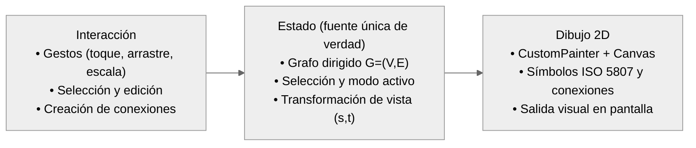
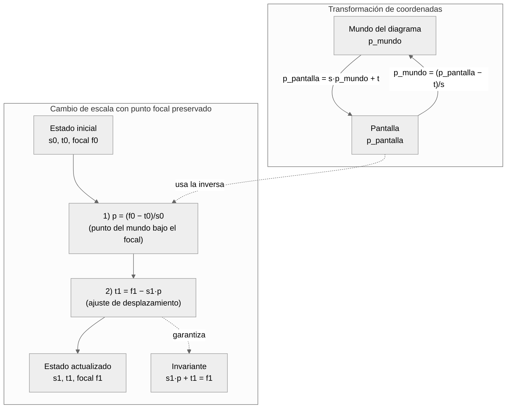
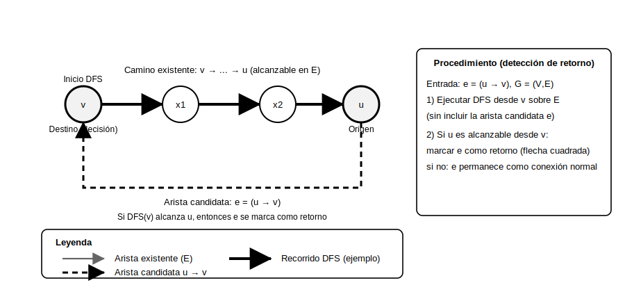

# 14. Implementación del Editor Visual

## 14.1 Arquitectura del Componente Editor

El editor visual se implementó como un módulo que integró: (1) orquestación de estado y acciones (crear/editar, validar, generar/compilar, guardar y exportar), (2) un lienzo interactivo con gestos y selección, y (3) un módulo de dibujo 2D que trazó símbolos y conexiones. Esta separación mantuvo el diagrama como "fuente única de verdad" y redujo el acoplamiento entre la interfaz de usuario (IU), la interacción y el dibujo.

El diagrama en ejecución se modeló como un grafo dirigido $G=(V,E)$:

- $V$: conjunto de nodos (símbolos ISO 5807) con identificador, tipo, posición, texto y metadatos técnicos.
- $E$: conjunto de conexiones (aristas) con origen/destino, etiqueta, anclas configurables y un modo especial para retornos (flecha cuadrada).

La representación en memoria se mantuvo con dos listas (nodos y conexiones) y estructuras auxiliares por identificador para reconstrucción consistente en operaciones de historial (deshacer/rehacer) y restauración de estado.

Figura sugerida: **Figura 42. Arquitectura del editor visual (estado, interacción y dibujo).**

### 14.1.1 Biblioteca de dibujo seleccionada

Se utilizó el sistema de dibujo nativo de Flutter (Material) con `CustomPainter` y `Canvas` [16]. Esta elección evitó dependencias gráficas externas y habilitó control directo sobre:

- Trazado vectorial de símbolos ISO 5807 mediante rutas (`Path`).
- Trazado de conexiones con polilíneas ortogonales, flecha y etiqueta.
- Transformaciones de desplazamiento y escala aplicadas al `Canvas`.
- Selección de nodos y aristas (detección geométrica).

El lienzo se encapsuló en `RepaintBoundary` para aislar repintados y permitir captura de imagen en exportación.

### 14.1.2 Modelo de datos para representación de diagramas

El modelo de nodo consideró:

- **Catálogo ISO 5807**: símbolos básicos (terminal, proceso, decisión, preparación, dato, proceso predefinido) y símbolos extendidos (almacenamientos, conectores, anotaciones, etc.).
- **Geometría**: cada tipo definió tamaño y una ruta geométrica (`Path`) para dibujo y selección.
- **Metadatos técnicos**: claves adicionales por nodo para distinguir estructuras de control y guiar la generación/compilación sin depender solo del texto visible.

Las conexiones incluyeron:

- Referencias a nodo origen y destino.
- Etiqueta (por ejemplo: "Verdadero/Falso", "Sí/No").
- Anclas de salida/entrada (`auto`, `arriba`, `abajo`, `izquierda`, `derecha`).
- Bandera de retorno (flecha cuadrada) para representar visualmente ciclos de control.

### 14.1.3 Sistema de coordenadas y ventana de visualización

El editor manejó dos espacios de coordenadas:

- **Mundo del diagrama**: posiciones lógicas de nodos y puntos de conexión.
- **Pantalla**: coordenadas tras aplicar escala y desplazamiento.

La relación utilizada durante el dibujo fue:

$$
\vec{p}_{pantalla} = s\,\vec{p}_{mundo} + \vec{t}
$$

Donde $s$ es el factor de escala y $\vec{t}=(t_x,t_y)$ es el desplazamiento. Para selección y gestos se aplicó la inversa:

$$
\vec{p}_{mundo} = \frac{\vec{p}_{pantalla}-\vec{t}}{s}
$$

El cambio de escala preservó el punto focal del gesto (evitando "saltos" visuales). Si $s_0$ y $\vec{t}_0$ son el estado inicial y $\vec{f}_0$ el focal inicial, el punto del mundo bajo los dedos se calculó como:

$$
\vec{p} = \frac{\vec{f}_0-\vec{t}_0}{s_0}
$$

Al actualizar a una nueva escala $s_1$ y focal $\vec{f}_1$, el nuevo desplazamiento se ajustó como:

$$
\vec{t}_1 = \vec{f}_1 - s_1\,\vec{p}
$$

Figura sugerida: **Figura 43. Transformación mundo–pantalla y cambio de escala con punto focal preservado.**

## 14.2 Dibujo de Símbolos

El dibujo se realizó en un pintor 2D sobre `Canvas`, aplicando primero la transformación de visualización (desplazamiento y escala). El orden de dibujo se mantuvo estable para asegurar legibilidad:

1. Aplicar `translate(...)` y `scale(...)` al `Canvas`.
2. Dibujar cuadrícula de referencia (paso fijo, p. ej. 20 unidades del mundo).
3. Dibujar conexiones (polilíneas + flecha + etiqueta).
4. Dibujar nodos (relleno + borde).
5. Dibujar texto de nodos.

En estados interactivos se aplicó retroalimentación visual:

- **Nodo seleccionado**: borde resaltado.
- **Nodo en arrastre**: estilo y sombra temporal para enfatizar el movimiento.
- **Símbolo de comentario**: borde discontinuo (patrón de guiones calculado con métricas de ruta).

### 14.2.1 Implementación de formas geométricas estándar

Cada símbolo ISO 5807 se definió como una geometría vectorial mediante `Path` [19]. Esto permitió:

- Dibujar el símbolo con precisión y escala arbitraria.
- Reutilizar la misma geometría para selección (`Path.contains`) tras convertir coordenadas a espacio local del nodo.

Ejemplos de construcción de símbolos:

- Terminal: óvalo (`addOval`).
- Proceso: rectángulo (`addRect`).
- Decisión: rombo (segmentos lineales y cierre de ruta).
- Preparación: hexágono (segmentos con offset lateral).
- Dato: paralelogramo (segmentos con inclinación).
- Símbolos extendidos: curvas con `quadraticBezierTo` y arcos con `arcToPoint` (p. ej. documento, almacenamiento directo).

### 14.2.2 Sistema de dibujo de texto

El texto se dibujó con `TextPainter` para controlar:

- Alineación centrada y límites de ancho (evitando desbordamiento dentro del símbolo).
- Posición consistente del texto al cambiar la escala.

Las etiquetas de conexiones también se pintaron con `TextPainter` y un rectángulo de fondo semitransparente para mantener contraste sobre el trazo de la arista.

## 14.3 Sistema de Interacción Táctil

La interacción utilizó `GestureDetector` con un gesto de escala como unificador (desplazamiento del lienzo, cambio de escala y arrastre), y un esquema de selección que priorizó el elemento "superior" cuando hubo superposición. En entornos con teclado, se incluyeron atajos estándar con `CallbackShortcuts` (por ejemplo, deshacer/rehacer).

### 14.3.1 Gestos Implementados

Los gestos activos en la versión implementada fueron:

- **Toque**: selección de nodo, selección de conexión o deselección.
- **Pulsación prolongada**: inicio de modo conexión desde un nodo.
- **Arrastre sobre nodo**: mover nodo en coordenadas del mundo.
- **Pellizco**: cambio de escala con punto focal preservado.
- **Desplazamiento**: movimiento de la ventana de visualización.

Para mejorar la robustez, el lienzo distinguió toque contra arrastre mediante un umbral pequeño de movimiento: si el dedo se desplazó más allá del umbral, el evento se trató como arrastre y no como selección.

## 14.4 Sistema de Conexiones (Aristas)

Las conexiones se crearon entre puntos de anclaje de nodos y se dibujaron como polilíneas ortogonales. Adicionalmente, se incorporó un modo de retorno (flecha cuadrada) para visualizar ciclos de control.

### 14.4.1 Algoritmo de enrutamiento de conexiones

Para conexiones normales se utilizó enrutamiento ortogonal (segmentos horizontales/verticales). El algoritmo:

1. Determinó la cara de salida y entrada (arriba, abajo, izquierda, derecha) con tolerancia (epsilon) sobre el borde del símbolo.
2. Calculó 1–2 puntos intermedios según el caso (vertical–vertical, horizontal–horizontal, vertical–horizontal, horizontal–vertical).
3. Aplicó un **desplazamiento determinista** derivado de una semilla (por ejemplo, un resumen determinista de los identificadores) para separar aristas que, de otra forma, quedarían totalmente superpuestas.

Para conexiones de retorno se utilizó una ruta cuadrada explícita (polilínea con varios segmentos rectos) y la etiqueta se colocó en el lado vertical para mantener consistencia visual.

La flecha se calculó con vectores normalizados:

- Dirección: $\hat{d}=\frac{\vec{p}_{fin}-\vec{p}_{inicio}}{\lVert\vec{p}_{fin}-\vec{p}_{inicio}\rVert}$
- Perpendicular: $\hat{n}=(-\hat{d}_y,\hat{d}_x)$

### 14.4.2 Cálculo de puntos de anclaje

Cada nodo expuso cuatro anclas (arriba/abajo/izquierda/derecha). Las conexiones operaron en dos modos:

- **Modo automático**: seleccionó el ancla más cercana al centro del nodo opuesto (minimizando longitud local).
- **Modo fijo**: permitió forzar anclas específicas rotando la configuración de salida/entrada, lo que mejoró la legibilidad en diagramas densos.

### 14.4.3 Detección de colisiones y enrutamiento

La selección de conexiones se implementó con distancia punto–segmento evaluada sobre todos los segmentos de la polilínea (incluyendo el caso de retorno cuadrado). Para un punto $P$ y el segmento $\overline{AB}$:

$$
t = \mathrm{clip}_{[0,1]}\left(\frac{(P-A)\cdot(B-A)}{\lVert B-A\rVert^2}\right),\quad C=A+t(B-A),\quad d=\lVert P-C\rVert
$$

Se consideró seleccionada la conexión si $d$ cayó por debajo de un umbral (tolerancia en píxeles del mundo).

### 14.4.4 Validación de Conexiones

La validación operó en dos niveles:

- **Reglas inmediatas en el editor**: evitó duplicados y conexiones triviales inválidas (p. ej., conectar un nodo consigo mismo), y controló acciones dependientes del modo conexión.
- **Validación estructural completa**: aplicó reglas del diagrama (símbolos obligatorios, cardinalidad de salidas, consistencia general) y reportó incidencias con retroalimentación visual.

Adicionalmente, el editor detectó retornos hacia nodos de decisión mediante un recorrido en profundidad (DFS) [7] que verificó si existía una ruta desde un nodo origen hasta un nodo destino en el grafo actual. Esta verificación se utilizó para marcar una arista como retorno (flecha cuadrada) cuando cerró un ciclo.

Al crear una conexión hacia una decisión, se verificó si ya existía una ruta desde esa decisión hacia el nodo de origen; si existía, la nueva arista cerró el ciclo y se marcó como retorno.

Formalmente, sea $G=(V,E)$ el grafo dirigido actual. Sea $e=(u\to v)$ la arista candidata que el usuario intentó añadir (donde $v$ es un nodo de decisión). Se definió alcanzabilidad $a\leadsto b$ si existe una secuencia de nodos $(x_0,\dots,x_k)$ tal que $x_0=a$, $x_k=b$ y $(x_i\to x_{i+1})\in E$ para todo $i\in[0,k-1]$.

Bajo esta definición, la arista $e$ creó un ciclo si y solo si $v\leadsto u$ ya era verdadero antes de insertar $e$. Si existía un camino $v\leadsto u$, al añadir $u\to v$ quedó cerrado el recorrido $v\leadsto u\to v$; si no existía tal camino, la inserción de $u\to v$ no pudo formar un ciclo que regresara a $v$.

La implementación redujo el problema a un chequeo de alcanzabilidad con DFS sobre el grafo actual (sin incluir todavía $e$) [7]:

1. Se construyó una estructura de adyacencia $Adj(x)=\{y\mid (x\to y)\in E\}$ a partir de las conexiones existentes.
2. Se ejecutó DFS iniciando en $v$ y manteniendo un conjunto de visitados para evitar exploración repetida.
3. Si durante el recorrido se alcanzó $u$, entonces $v\leadsto u$ y la nueva arista se marcó como retorno (habilitando el trazado cuadrado); si el DFS terminó sin alcanzar $u$, la conexión se conservó como estándar.

En el peor caso, el costo temporal del chequeo fue $O(|V|+|E|)$ y el estado auxiliar requerido fue $O(|V|)$.

Figura sugerida: **Figura 46. Detección de retorno: DFS desde el destino $v$ para verificar alcanzabilidad de $u$ antes de insertar $u\to v$.**

### 14.4.5 NIVEL 1: VALIDACIÓN ESTRUCTURAL DEL GRAFO (conversor)

Previo a la conversión del diagrama a código, se ejecuta una validación estructural sobre el grafo dirigido $G=(V,E)$ para asegurar que la topología básica y ciertas restricciones ISO 5807 sean coherentes. Este nivel se invoca al solicitar la validación del diagrama y se usa como precondición en la generación de código directa (si hay errores, la conversión se detiene y se presenta el reporte). El resultado se reporta como dos conjuntos de mensajes:

- **Errores**: invalidan el diagrama y bloquean la conversión.
- **Advertencias**: no bloquean la conversión, pero señalan condiciones incompletas o potencialmente ambiguas.

La implementación trabaja sobre listas de nodos y conexiones y, para cada nodo $v\in V$, deriva sus conexiones entrantes y salientes a partir de $E$:

$$
In(v)=\{(u\to v)\in E\},\qquad Out(v)=\{(v\to w)\in E\}
$$

Las validaciones estructurales programadas en la aplicación son:

| Regla | Severidad | Condición (criterio) |
|---|---|---|
| Diagrama no vacío | Error | $\lvert V \rvert = 0$ |
| Inicio principal presente | Error | No existe un nodo terminal considerado “Inicio” del programa principal: texto vacío o contiene indicadores de inicio (p. ej., “inicio”, “comenzar”); además, no contiene paréntesis y, si el texto tiene más de una palabra, se descarta cuando la segunda palabra no es {de, del, programa, principal} y comienza con mayúscula en el texto original (heurística de subproceso). |
| Inicio principal único | Error | Existen dos o más terminales considerados “Inicio” del programa principal. |
| Fin principal presente | Error | No existe un nodo terminal considerado “Fin” del programa principal: el texto contiene indicadores de fin (p. ej., “fin”, “terminar”); además, no contiene paréntesis y, si el texto tiene más de una palabra, se descarta cuando la segunda palabra no es {de, del, programa, principal} y comienza con mayúscula en el texto original (heurística de subproceso). |
| Inicio con salida | Error | Para el inicio principal $s$: $\lvert Out(s) \rvert = 0$. |
| Fin sin salidas | Error | Existe un fin principal $t$ con $\lvert Out(t) \rvert > 0$. |
| Decisión con ramificación insuficiente | Advertencia | Para un nodo de decisión $d$: $\lvert Out(d) \rvert = 0$ o $\lvert Out(d) \rvert = 1$. |
| Preparación sin entrada | Advertencia | Para un nodo de preparación $p$: $\lvert In(p) \rvert = 0$. |
| Preparación sin salida | Advertencia | Para un nodo de preparación $p$: $\lvert Out(p) \rvert = 0$. |
| Preparación sin retorno | Advertencia | Para un nodo de preparación $p$ con $\lvert Out(p) \rvert > 0$: no existe un camino que regrese a $p$ desde alguno de sus destinos (búsqueda DFS sobre $E$). |
| Junción sin conexiones | Advertencia | Para una junción de acoplamiento o una junción de suma $j$: $\lvert In(j) \rvert = 0$ y $\lvert Out(j) \rvert = 0$. |
| Nodo sin entradas (flujo) | Advertencia | Para cualquier nodo $v$ que participa en flujo (excluye anotación/comentario, conectores y terminal de inicio con texto vacío o que contiene indicadores de inicio): $\lvert In(v) \rvert = 0$. |
| Nodo sin salidas (flujo) | Advertencia | Para cualquier nodo $v$ que participa en flujo (excluye anotación/comentario, conectores, terminal de fin con texto que contiene indicadores de fin y símbolos de almacenamiento de datos): $\lvert Out(v) \rvert = 0$. |
| Conector sin conexiones | Advertencia | Para conector (en página / fuera de página) $c$: $\lvert In(c) \rvert = 0$ y $\lvert Out(c) \rvert = 0$. |
| Conector sin etiqueta | Advertencia | Para conector $c$: etiqueta vacía (se recomienda etiquetar). |
| Conector sin par correspondiente | Advertencia | Para conector $c$ con etiqueta no vacía: no existe otro conector (en página o fuera de página) con la misma etiqueta. |
| Modo paralelo sin entrada | Advertencia | Para nodo de modo paralelo $p$: $\lvert In(p) \rvert = 0$. |
| Modo paralelo con salidas insuficientes | Advertencia | Para nodo de modo paralelo $p$: $\lvert Out(p) \rvert < 2$. |
| Límite de bucle sin entrada | Advertencia | Para nodo de límite de bucle $l$: $\lvert In(l) \rvert = 0$. |
| Límite de bucle con salidas insuficientes | Advertencia | Para nodo de límite de bucle $l$: $\lvert Out(l) \rvert < 2$. |
| Operación manual sin entrada | Advertencia | Para nodo de operación manual $m$: $\lvert In(m) \rvert = 0$. |
| Operación manual sin salida | Advertencia | Para nodo de operación manual $m$: $\lvert Out(m) \rvert = 0$. |
| Subproceso sin entrada | Advertencia | Para proceso predefinido (subproceso) $s$: $\lvert In(s) \rvert = 0$. |
| Subproceso sin salida | Advertencia | Para proceso predefinido (subproceso) $s$: $\lvert Out(s) \rvert = 0$. |
| Subproceso sin nombre | Advertencia | Para proceso predefinido (subproceso) $s$: etiqueta vacía. |
| Almacenamiento sin conexiones | Advertencia | Para símbolos de almacenamiento de datos (dato/almacenamientos/documento/tarjeta/cinta, etc.) $a$: $\lvert In(a) \rvert = 0$ y $\lvert Out(a) \rvert = 0$. |

En conjunto, este nivel actúa como un filtro de integridad del grafo antes de las fases de traducción, reduciendo fallos por diagramas incompletos y estandarizando la estructura mínima requerida por el conversor.

## 14.5 Funcionalidades de Edición Avanzadas

El editor mantuvo un historial de cambios en memoria para revertir y re-aplicar operaciones. Este historial incluyó el estado del grafo (nodos, conexiones) y la selección activa.

### 14.5.1 Sistema de deshacer/rehacer

El mecanismo se basó en instantáneas profundas:

- Se registró una instantánea tras operaciones que modificaron el grafo.
- Cada instantánea clonó nodos y conexiones para evitar efectos por referencias mutables.
- El historial se acotó a 100 estados; al rebasar el límite se descartó el más antiguo.
- El deshacer/rehacer se implementó moviendo un índice dentro del historial y restaurando la instantánea correspondiente.

## 14.6 Operaciones sobre Elementos

La edición de elementos se realizó mediante creación, modificación y eliminación. Al eliminar un nodo, se eliminaron también sus conexiones asociadas. No se implementaron operaciones dedicadas de copiado, cortado, pegado ni duplicación de nodos individuales; como alternativa, el panel de estructuras permitió insertar bloques completos (por ejemplo: if–else, while, for, switch) en una sola acción. El posicionamiento fue manual, con soporte de cuadrícula visual y herramientas de desplazamiento y cambio de escala para mayor precisión.
